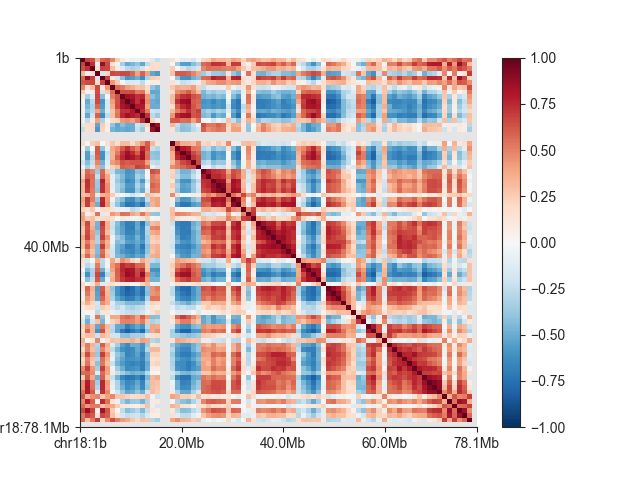
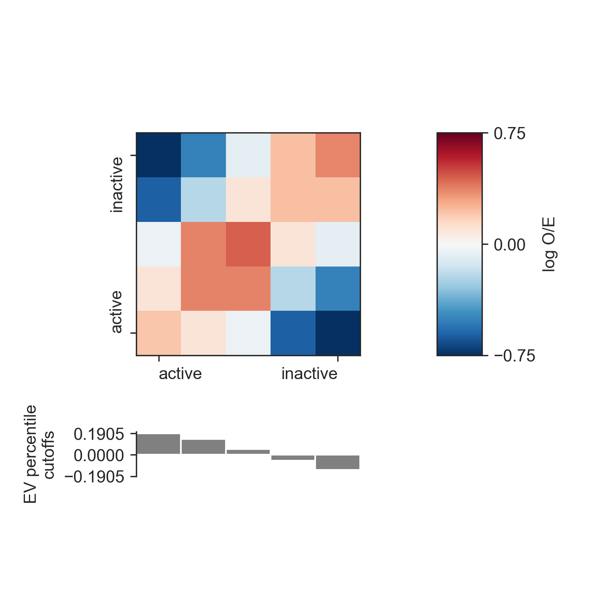

.. _api_compartments:

###############
AB compartments
###############

The following steps assume that you ran the ``fanc auto`` command in :ref:`example-fanc-auto`.
Additionally, we set up the Python session like this:

.. literalinclude:: code/ab_example_code.py
    :language: python
    :start-after: start snippet ab setup
    :end-before: end snippet ab setup

If you want to try the tutorial with an equivalent Cooler file, load the Hi-C file like
this instead:

.. literalinclude:: code/ab_example_code.py
    :language: python
    :start-after: start snippet alternative cooler
    :end-before: end snippet alternative cooler

or like this if you want to work with a Juicer file built from the same data:

.. literalinclude:: code/ab_example_code.py
    :language: python
    :start-after: start snippet alternative juicer
    :end-before: end snippet alternative juicer

Note that there may be minor differences in the results due to the "zooming" and balancing
applied by the different tools.

AB correlation matrices can very easily be obtained from Hi-C files using the
:func:`~fanc.architecture.compartments.ABCompartmentMatrix.from_hic` function:

.. literalinclude:: code/ab_example_code.py
    :language: python
    :start-after: start snippet ab matrix
    :end-before: end snippet ab matrix

The ``ab`` object acts like any FAN-C matrix (see :ref:`matrix_interface`), which means you
can query and subset the data any way you like. For example, to get the correlation matrix
of chromosome 18:

.. literalinclude:: code/ab_example_code.py
    :language: python
    :start-after: start snippet ab subset
    :end-before: end snippet ab subset

And to visualise the matrix:

.. literalinclude:: code/ab_example_code.py
    :language: python
    :start-after: start snippet ab fancplot-correlation
    :end-before: end snippet ab fancplot-correlation

============
Eigenvectors
============

The AB correlation matrix eigenvector (EV) is used to determine if a region is in the active (A) or
the inactive (B) compartment. It's calculation is very straightforward:

.. literalinclude:: code/ab_example_code.py
    :language: python
    :start-after: start snippet ab ev
    :end-before: end snippet ab ev

:func:`~fanc.architecture.compartments.ABCompartmentMatrix.eigenvector` returns a numpy
array with one entry per region in the AB correlation matrix (you can retrieve a matching
list of regions with :func:`~fanc.architecture.compartments.ABCompartmentMatrix.regions`).
You can also retrieve only the EV entries for a specific region using the ``sub_region``
argument, but note that the calculation is always performed on the entire genome first
to avoid biases from subsetting.

.. warning::

   Positive EV entries do not automatically mean a region is in the A compartment. In fact,
   if positive or negative entries are representing the A compartment is dependent on
   the implementation of PCA on the platform you are using. Therefore we strongly recommend
   using additional biological information to determine the correspondence between EV entry
   sign and compartment.

   One option implemented in FAN-C is to use GC content as a proxy for activity, as GC-rich
   regions have been shown to be associated with the active compartment. FAN-C implements the
   use of a genomic FASTA file, to calculate GC content and then choose the EV sign so that
   positive entries correspond to A, and negative entries to the B compartment.

   .. literalinclude:: code/ab_example_code.py
       :language: python
       :start-after: start snippet ab gc-ev
       :end-before: end snippet ab gc-ev

To plot the EV, you can use :class:`~fanc.plotting.LinePlot`:

.. literalinclude:: code/ab_example_code.py
    :language: python
    :start-after: start snippet ab plot-ev
    :end-before: end snippet ab plot-ev

.. image:: images/ab_1mb_ev.png

=================================
Enrichment profiles (Saddle plot)
=================================

An enrichment profile, which is used to create a :func:`~fanc.plotting.saddle_plot` is used
to show how "interactive" genomic regions belonging to the A or B compartment are. To
calculate the enrichment profile, first all genomic regions are divided into bins, according
to their EV value (the "compartment strength"). Then, we use the O/E matrix the average O/E
value between all region bins, and take the log2 of the result. Everything is summarised in
a matrix, where rows and columns correspond to the genomic region bins, and matrix entries
reflect the bins' interactivity. Positive values reflect more than expected contacts, while
negative values reflect less than expected contacts.

In FAN-C, you can use the :func:`~fanc.architecture.compartments.ABCompartmentMatrix.enrichment_profile`
function for this purpose:

.. literalinclude:: code/ab_example_code.py
    :language: python
    :start-after: start snippet ab profile
    :end-before: end snippet ab profile

:func:`~fanc.architecture.compartments.ABCompartmentMatrix.enrichment_profile` also returns
the EV cutoffs calculated from the ``percentiles`` argument. To get a higher resolution
of the enrichment matrix, use more finely-grained percentiles.

You can use the :func:`~fanc.plotting.saddle_plot` function to plot the results:

.. literalinclude:: code/ab_example_code.py
    :language: python
    :start-after: start snippet ab saddle
    :end-before: end snippet ab saddle

Since the layout of the matrix and the cutoffs barplot is somewhat complex, the function
generates its own figure and axes, which for the return values. You can, however,
specify your own axes using the ``axes`` parameter. You need to supply three axes:
one for the matrix, one for the barplot, and one for the colorbar. This allows you to
integrate the saddle plot into more complex figures. If you supply ``None`` as any
of the axes, the corresponding plot will not be generated.

