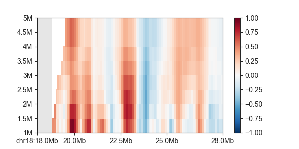
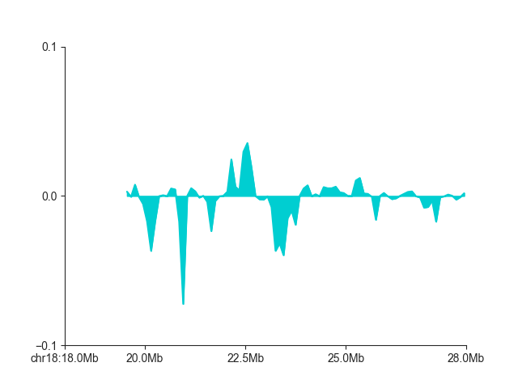

.. _api_tads:

#######################
TADs and TAD boundaries
#######################

To follow this tutorial, download the FAN-C example data, for example through our
`Keeper library <https://keeper.mpdl.mpg.de/d/147906745b634c779ed3/>`_. Then run the
example ``fanc auto`` command in  :ref:`example-fanc-auto` to generate all the
necessary files, and set up your Python session like this:

.. literalinclude:: code/domains_example_code.py
    :language: python
    :start-after: start snippet domains setup
    :end-before: end snippet domains setup

If you want to try the tutorial with an equivalent Cooler file, load the Hi-C file like
this instead:

.. literalinclude:: code/domains_example_code.py
    :language: python
    :start-after: start snippet alternative cooler
    :end-before: end snippet alternative cooler

or like this if you want to work with a Juicer file built from the same data:

.. literalinclude:: code/domains_example_code.py
    :language: python
    :start-after: start snippet alternative juicer
    :end-before: end snippet alternative juicer

Note that there may be minor differences in the results due to the "zooming" and balancing
applied by the different tools.

Also have a look at the command line documentation at :ref:`fanc-domains`, which explains
a lot of the principles behind insulation scores and directionality indexes with a couple
of helpful illustrations.

*****************
Insulation scores
*****************

Insulation scores are calculated and saved to disk using the :class:`~fanc.architecture.domains.InsulationScores`
class. To run a basic insulation score calculation on a Hi-C object, use
:class:`~fanc.architecture.domains.InsulationScores.from_hic`:

.. literalinclude:: code/domains_example_code.py
    :language: python
    :start-after: start snippet insulation basic
    :end-before: end snippet insulation basic

The file created in ``file_name`` can later be easily loaded with :func:`~fanc.load`.

The resulting object stores all insulation score tracks for the ``window_sizes``
provided. It is derived from the :class:`~fanc.regions.RegionsTable` class, which is
:class:`~genomic_regions.RegionBased`. There is a lot of convenient functionality
bundled in these objects, which you can read about in :ref:`genomic_regions`.

You can access the calculated scores by using the
:func:`~fanc.architecture.domains.InsulationScores.scores` function, which requires
the window size of the scores you want to retrieve, and returns a list of scores,
one for each genomic region in the object:

.. literalinclude:: code/domains_example_code.py
    :language: python
    :start-after: start snippet insulation scores
    :end-before: end snippet insulation scores

However, a more flexible way to retrieve scores, which allows things like subsetting and
retrieving region information at the same time, is the :func:`~genomic_regions.RegionBased.regions`
iterator. Scores are stored as a region attribute ``insulation_<window size>``:

.. literalinclude:: code/domains_example_code.py
    :language: python
    :start-after: start snippet insulation regions
    :end-before: end snippet insulation regions

If you prefer to have a dedicated object for a particular window size, you can use
:func:`~fanc.architecture.domains.InsulationScores.score_regions`. The score is then
accessible via the ``score`` attribute:

.. literalinclude:: code/domains_example_code.py
    :language: python
    :start-after: start snippet insulation score_regions
    :end-before: end snippet insulation score_regions

~~~~~~~~~~~~~~~~~~~~~~~~~~~~~~~~~
Insulation calculation parameters
~~~~~~~~~~~~~~~~~~~~~~~~~~~~~~~~~

:class:`~fanc.architecture.domains.InsulationScores.from_hic` has several parameters that
allow you to customise the insulation score calculation. You can read everything them in the
linked API reference, and we will highlight the most important ones here.

``impute_missing`` allows you to replace missing or masked pixels with their expected values
prior to the insulation score calculation. While this avoids dealing with missing pixels,
this can be misleading in case larger regions are unmappable or have been filtered out for
some other reason, so enable this setting with caution. The related parameter
``na_threshold`` instead controls how much of a sliding window can be covered by missing
pixels before assigning it NaN by default. This is set to ``0.5`` by default - by increasing
this value you will obtain more robust scores, but also the number of NaNs will increase in
your results. Whatever value you choose, it is a tradeoff between information content and
accuracy. In most cases you should be okay with the default setting.

``normalise``, which is enabled by default, divides insulation scores by their chromosome
mean, so every score is expressed relative to the expected score on the same chromosome. By
disabling this option, you will get raw sums of weights in the sliding window. Normalisation
is stringly recommended, however. You can also normalise to a more local region instead of the
whole chromosome, which may account for local variations in contact intensity other than
insulation. For this purpose, set ``normalisation_window`` to a number of bins, for example
``300``, which is then the number of scores surrounding each region used for normalisation by
their mean.

After their computation and normalisation, insulation scores are log2-transformed. This
makes scores (roughly) symmetrical around 0. To disable this, for example if you have also
disabled ``normalise``, use ``log=False``.

The original insulation score definition uses the arithmetic mean to normalise the scores.
If you expect insulation score outliers in your data, which might affect the normalisation by
the mean, you can use a trimmed arithmetic mean instead by setting ``trim_mean_proportion``
to a value between 0 and 1. The top fraction of insulation scores is then discarded for
calculating the mean.

If you intend to compare scores from different samples (and have the ``normalise`` and
``log`` options enabled), a mathematically more accurate normalisation would be to use the
geometric mean instead. You can enable this by setting ``geometric_mean=True``.

~~~~~~~~~~~~~~~~~~~~~~~
Insulation score export
~~~~~~~~~~~~~~~~~~~~~~~

You can export scores to a human-readable file format using one of
:func:`~fanc.architecture.domains.InsulationScores.to_bed`, or
:func:`~fanc.architecture.domains.InsulationScores.to_gff`. Export to a fast BigWig track using
:func:`~fanc.architecture.domains.InsulationScores.to_bigwig`.

.. literalinclude:: code/domains_example_code.py
    :language: python
    :start-after: start snippet insulation export
    :end-before: end snippet insulation export

~~~~~~~~~~~~~~~~~~~~~~
Insulation score plots
~~~~~~~~~~~~~~~~~~~~~~

You can plot all calculated insulation scores using :class:`~fanc.plotting.GenomicVectorArrayPlot`:

.. literalinclude:: code/domains_example_code.py
    :language: python
    :start-after: start snippet insulation multiplot
    :end-before: end snippet insulation multiplot

If you only want to plot a single score track, use :class:`~fanc.plotting.LinePlot`:

.. literalinclude:: code/domains_example_code.py
    :language: python
    :start-after: start snippet insulation singleplot
    :end-before: end snippet insulation singleplot

.. image:: images/domains_single.png

You can read more about different plot types in :ref:`api_plot`.

**************
Boundary calls
**************

Once you have the ``insulation`` object, you can call insulating boundaries in the genome
using :class:`~fanc.architecture.domains.Boundaries`, specifically
:func:`~fanc.architecture.domains.Boundaries.from_insulation_score`:

.. literalinclude:: code/domains_example_code.py
    :language: python
    :start-after: start snippet boundaries run
    :end-before: end snippet boundaries run

This finds all minima in the insulation score vector and returns the corresponding regions
as a :class:`~fanc.regions.RegionsTable` object, which is :ref:`genomic_regions`. The
boundary strength is stored in the ``score`` attribute of each region:

.. literalinclude:: code/domains_example_code.py
    :language: python
    :start-after: start snippet boundaries regions
    :end-before: end snippet boundaries regions

By default, all minima are reported, including very weak and likely false-positive boundaries.
We recommend plotting the boundaries and their strength alongside the Hi-C matrix and then decide
on a score cutoff to only select a robust set of boundaries!

.. literalinclude:: code/domains_example_code.py
    :language: python
    :start-after: start snippet boundaries plot
    :end-before: end snippet boundaries plot

.. image:: images/boundaries.png

You can filter out false-positives
manually like this

.. literalinclude:: code/domains_example_code.py
    :language: python
    :start-after: start snippet boundaries fp
    :end-before: end snippet boundaries fp

or by simply using the ``min_score`` argument:

.. literalinclude:: code/domains_example_code.py
    :language: python
    :start-after: start snippet boundaries minscore
    :end-before: end snippet boundaries minscore

********************
Directionality index
********************

For a short explanation of the directionality index, please read :ref:`directionality-index`.
The principle to compute the directionality index is highly similar to the insulation score.
The dedicated class :class:`~fanc.architecture.domains.DirectionalityIndexes` handles all
relevant actions. Use :func:`~fanc.architecture.domains.DirectionalityIndexes.from_hic` to
compute it for multiple window sizes:

.. literalinclude:: code/domains_example_code.py
    :language: python
    :start-after: start snippet directionality basic
    :end-before: end snippet directionality basic

Plotting also works the same way, for all indexes:

.. literalinclude:: code/domains_example_code.py
    :language: python
    :start-after: start snippet directionality multiplot
    :end-before: end snippet directionality multiplot

.. image:: images/directionality_multi.png

And for single a single directionality index:

.. literalinclude:: code/domains_example_code.py
    :language: python
    :start-after: start snippet directionality singleplot
    :end-before: end snippet directionality singleplot

