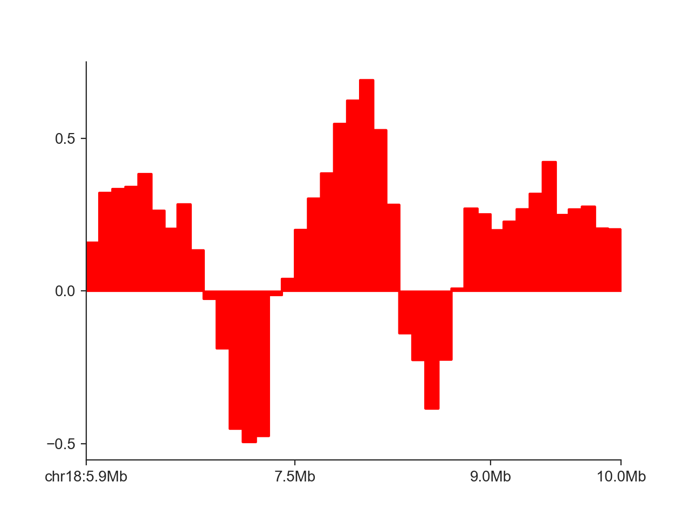
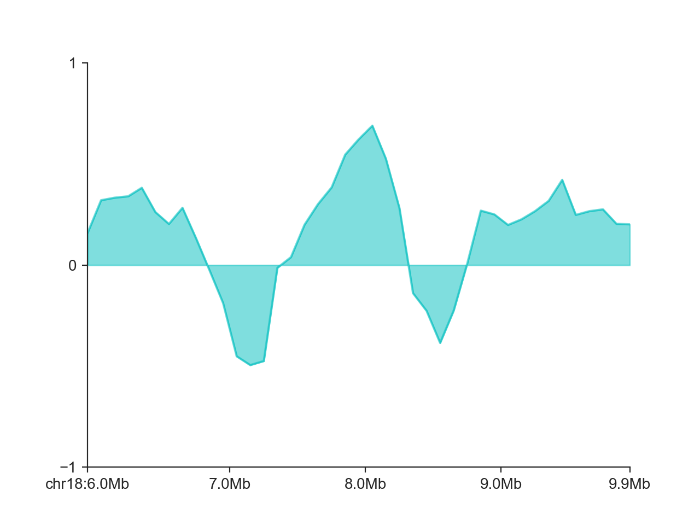
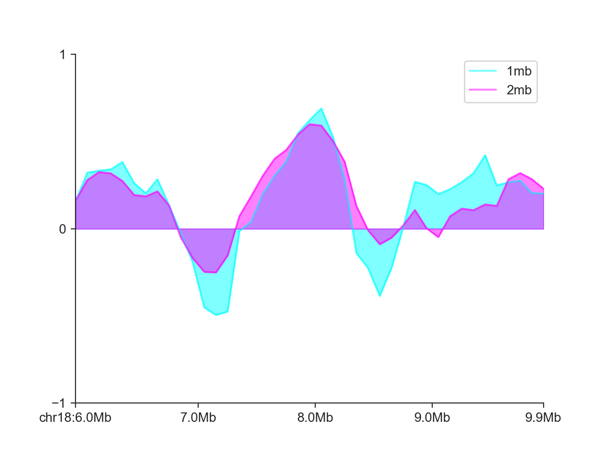
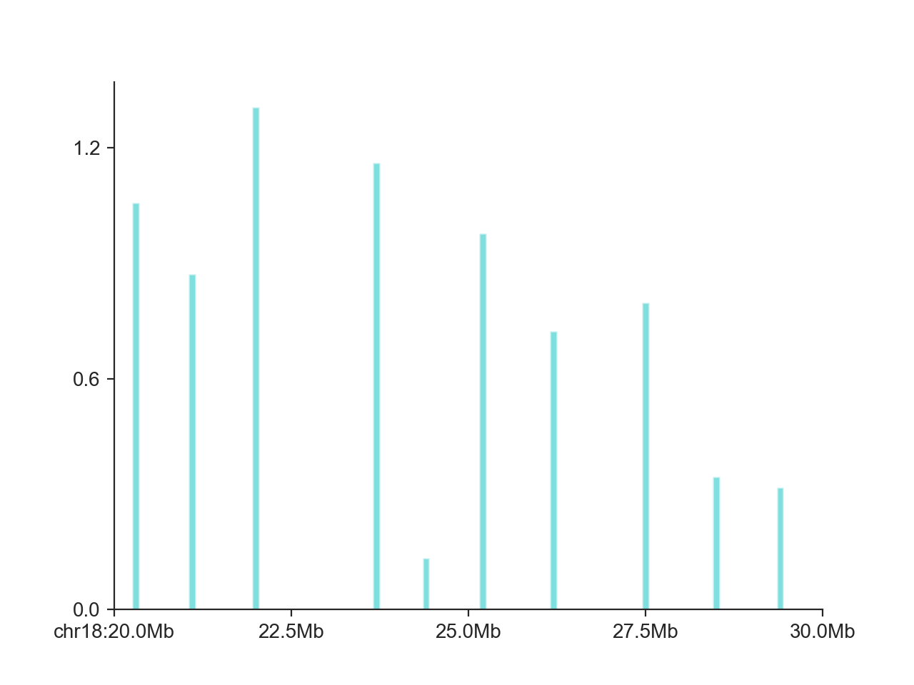

.. _api_plot_region:

======================
Region and score plots
======================

In addition to matrix-based plots, FAN-C provides a number of plots to plot genomic tracks alongside
Hi-C data (although they can certainly also be used independently). The main plots in this category are

- :class:`~fanc.plotting.plotter.LinePlot`, which plots (ideally continuous) scores associated with genomic
  regions as a line plot.
- :class:`~fanc.plotting.plotter.BarPlot`, which plots genomic region scores as bars
- :class:`~fanc.plotting.plotter.GenomicVectorArrayPlot`, which plots multiple scores associated with the
  same regions, such as insulation scores at different window sizes, as a heatmap
- :class:`~fanc.plotting.plotter.FeatureLayerPlot`, which plots the location of features as blocks, grouped
  by user-specified attributes, such as the location TAD boundaries in different matrices
- :class:`~fanc.plotting.plotter.GenePlot`, which, as the name suggests, can plot gene and transcript
  annotations, including exon-intron structures.

*********
Line plot
*********

:class:`~fanc.plotting.plotter.LinePlot` accepts a :class:`~genomic_regions.RegionBased` object as input.
These can be created very easily from any compatible genomic regions format, including BED, GFF/GTF, BigWig,
Tabix, and more. So let's load some BED files:

.. literalinclude:: code/region_plot_examples.py
    :language: python
    :start-after: start snippet fancplot load bed
    :end-before: end snippet fancplot load bed

We can then use that directly as input:

.. literalinclude:: code/region_plot_examples.py
    :language: python
    :start-after: start snippet fancplot line fill
    :end-before: end snippet fancplot line fill

By default, FAN-C fills the area between the X axis and the curve. We can disable that using
``fill=False``:

.. literalinclude:: code/region_plot_examples.py
    :language: python
    :start-after: start snippet fancplot line nofill
    :end-before: end snippet fancplot line nofill

.. image:: images/plot_line_nofill.png

Instead of the step-wise style of the line, we can only connect points at each midpoint of the genomic
regions:

.. literalinclude:: code/region_plot_examples.py
    :language: python
    :start-after: start snippet fancplot line mid
    :end-before: end snippet fancplot line mid

.. image:: images/plot_line_mid.png

We can change the color of the line with ``colors``. Other plot aspects affecting the line drawing,
passed to the internal matplotlib ``ax.plot`` function, can be controlled through the ``plot_kwargs``
dictionary, as shown here for transparency:

.. literalinclude:: code/region_plot_examples.py
    :language: python
    :start-after: start snippet fancplot line col
    :end-before: end snippet fancplot line col

.. image:: images/plot_line_col.png

Finally, we can control the y axis limits with ``ylim`` (or you can use a `custom axis <api_plot_matplotlib>`_.

.. literalinclude:: code/region_plot_examples.py
    :language: python
    :start-after: start snippet fancplot line ylim
    :end-before: end snippet fancplot line ylim

It is also possible to add multiple score tracks to the same :class:`~fanc.plotting.plotter.LinePlot`:

.. literalinclude:: code/region_plot_examples.py
    :language: python
    :start-after: start snippet fancplot line multi
    :end-before: end snippet fancplot line multi

********
Bar plot
********

The :class:`~fanc.plotting.plotter.BarPlot` works in virtually the same way as the
:class:`~fanc.plotting.plotter.LinePlot`:

.. literalinclude:: code/region_plot_examples.py
    :language: python
    :start-after: start snippet fancplot bar basic
    :end-before: end snippet fancplot bar basic

.. image:: images/plot_bar.png

In addition, it also works very well for non-continuous data, such as shown here for domain boundaries
in a larger interval:

.. literalinclude:: code/region_plot_examples.py
    :language: python
    :start-after: start snippet fancplot bar boundaries
    :end-before: end snippet fancplot bar boundaries

**************
Score heatmaps
**************

***********
Layer plots
***********

**********
Gene plots
**********
