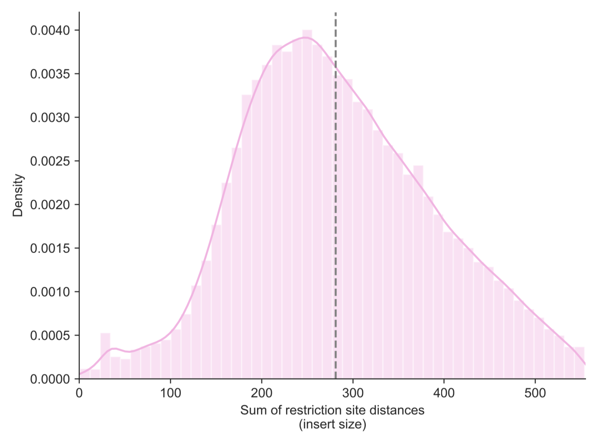

.. _fanc-modular:

#########################
Individual pipeline steps
#########################

.. _fanc-map:

=============================
fanc map: Mapping FASTQ files
=============================

To (iteratively) map FASTQ files directly with FAN-C, use the ``fanc map`` command.

Here is a minimal example:

.. code:: bash

    fanc map SRR4271982_chr18_19_1.fastq.gzip bwa-index/hg19_chr18_19.fa \
             SRR4271982_chr18_19_1.sam

This command will map the FASTQ file ``SRR4271982_chr18_19_1.fastq.gzip`` using the BWA
index specified with ``-i bwa-index/hg19_chr18_19.fa`` and output the mapped reads
to ``SRR4271982_chr18_19_1.sam``.

.. note::

   When downloading FASTQ files from SRA using SRAtools, e.g. with `fastq-dump`, do not
   use the ``-I / --readids`` option, which appends ``.1`` or ``.2`` to the read name. This
   interferes with the sorting and read pairing step in FAN-C. **Read names of the two mates
   must be identical**.

You can change the suffix of the output file to ``.bam``
and ``fanc map`` will automatically convert the mapping output to BAM format.

Importantly, ``fanc map`` will autodetect if you supply a BWA or Bowtie2 index, so
the following command would use Bowtie2 as a mapper:

.. code:: bash

    fanc map SRR4271982_chr18_19_1.fastq.gzip hg19_chr18_19/hg19_chr18_19 \
             SRR4271982_chr18_19_1.sam

You can use additional parameters to control the mapping process:

.. argparse::
   :module: fanc.commands.fanc_commands
   :func: map_parser
   :prog: fanc map
   :nodescription:
   :nodefault:

Most importantly, assign more threads to the mapping process using the ``-t`` parameter.
``fanc auto`` parallelises mapping by spawning multiple mapping processes internally.
This can result in high disk I/O - if you have issues with poor performance,
try using the ``--mapper-parallel`` option, which will instead use the multithreading
of your chosen mapping software.

.. code:: bash

    fanc map SRR4271982_chr18_19_1.fastq.gzip bwa-index/hg19_chr18_19.fa \
             SRR4271982_chr18_19_1.sam -t 16

By default, ``fanc auto`` performs iterative mapping: Reads are initially trimmed to 25bp
(change this with the ``-m`` option) before mapping, and then iteratively expanded by 10bp
(change the step size with the ``-s`` option) until a unique, high quality mapping location
can be found. The associated quality cutoff is 3 for BWA and 30 for Bowtie2, but can be
changed with the ``-q`` parameter.

.. code:: bash

    # expand by 5bp every iteration and be satisfied with lower quality
    fanc map SRR4271982_chr18_19_1.fastq.gzip bwa-index/hg19_chr18_19.fa \
             SRR4271982_chr18_19_1.sam -t 16 -s 5 -q 10

The iterative mapping process is slower than simple mapping, but can typically
improve mapping efficiency by a few percent, as smaller reads have a lower likelihood of
mismatches due to sequencing errors. Disable iterative mapping with the ``--no-iterative``
parameter.

.. code:: bash

    # do not perform iterative mapping
    fanc map SRR4271982_chr18_19_1.fastq.gzip bwa-index/hg19_chr18_19.fa \
             SRR4271982_chr18_19_1.sam -t 16 --no-iterative

BWA will automatically split chimeric reads and return both mapping locations. This is
especially useful for Hi-C data, as reads are often sequenced through a ligation junction,
which BWA can often detect automatically. Nonetheless, mapping may be improved by splitting
reads at predicted ligation junctions from the start. To enable this, use the ``-r`` parameter
and supply the name of a restriction enzyme (e.g. HindIII or MboI). The name will be used to
look up the enzyme's restriction pattern, predict the sequence of a ligation junction, and
split reads at the predicted junction before mapping starts. Reads split in this manner will
have an additional attribute in the SAM/BAM file ``ZL:i:<n>`` where <n> is an integer denoting
the part of the split read.

.. code:: bash

    # Split reads at HindIII ligation junction before mapping
    fanc map SRR4271982_chr18_19_1.fastq.gzip bwa-index/hg19_chr18_19.fa \
             SRR4271982_chr18_19_1.sam -t 16 -r HindIII

If you are using Bowtie2, you can additionally use the ``--memory-map`` option,
which will load the entire Bowtie2 index into memory to be shared across all Bowtie2 processes. Use
this option if your system has a lot of memory available to speed up the mapping. Finally, if you
are using the ``-tmp`` option, which causes ``fanc auto`` to perform most pipeline steps in a
temporary directory, you may want to use the ``--split-fastq`` option to split the FASTQ files into
smaller chunks before mapping, so you can save space on your ``tmp`` partition.

.. _fanc-pairs:

===============================================
fanc pairs: Generating and filtering read Pairs
===============================================

The ``fanc pairs`` command handles the creation and modification of Pairs objects, which represent
the mate pairs in a Hi-C library mapped to restriction fragments. Possible inputs are: two SAM/BAM
files (paired-end reads, sorted by read name), a
`HiC-Pro valid pairs file <http://nservant.github.io/HiC-Pro/RESULTS.html#list-of-valid-interaction-products>`_,
a `4D Nucleome pairs file <https://github.com/4dn-dcic/pairix/blob/master/pairs_format_specification.md>`_,
or an existing FAN-C Pairs object. For all but the latter, an output file is also required as last
positional argument, for Pairs files the output file is optional. If omitted, filtering is performed
in place.

.. warning::

    If you are providing sorted SAM/BAM files as input to ``fanc pairs``, they must be sorted either
    using ``samtools sort -n`` or ``sambamba sort -N``. You cannot use ``sambamba sort -n``
    (note the lowercase ``n``), as this will do a lexicographic sort, which is incompatible with FAN-C!

Here are example commands for the different options.

SAM/BAM files:

.. code:: bash

    fanc pairs output/sam/SRR4271982_chr18_19_1_sort.bam \
               output/sam/SRR4271982_chr18_19_2_sort.bam \
               output/pairs/SRR4271982_chr18_19.pairs \
               -g hg19_chr18_19_re_fragments.bed

4D Nucleome pairs file:

.. code:: bash

    fanc pairs 4d_nucleome.pairs output/pairs/4d_nucleome.pairs \
               -g hg19_chr18_19_re_fragments.bed

HiC-Pro valid pairs file:

.. code:: bash

    fanc pairs hic_pro.validPairs output/pairs/hic_pro.pairs \
               -g hg19_chr18_19_re_fragments.bed

Existing FAN-C Pairs object:

.. code:: bash

    fanc pairs output/pairs/SRR4271982_chr18_19.pairs

As you can see, the ``-g`` parameter is not necessary when proving an existing Pairs object,
as this already has all the fragment information stored in the object. Neither do we need an
output file, as further operations will be performed in place. This primarily applies to
the filtering of read pairs according to various criteria.

.. note::

   **Read names of the two mates must be identical**. Some read names, especially those obtained
   from SRA using SRAtools with the ``-I / --readids`` option, have ``.1`` or ``.2`` appended
   to the read name. This interferes with the sorting and read pairing step in FAN-C, and you
   need to remove those endings before import.

Additional parameters primarily control the filtering of read pairs:

.. argparse::
   :module: fanc.commands.fanc_commands
   :func: pairs_parser
   :prog: fanc pairs
   :nodescription:
   :nodefault:

*********
Filtering
*********

``fanc pairs`` provides a lot of parameters for filtering read pairs according to different
criteria. By default, if not specified otherwise, no filtering is performed on the read pairs
(passthrough). Typically, however, you will at least want to filter out unmappable (``-m``)
and multimapping reads (``-u`` or ``-us``). It is also a good idea to filter by alignment
quality (``-q <n>``). Good cutoffs for Bowtie2 and BWA are 30 and 3, respectively. If you suspect
your Hi-C library to be contaminated by DNA from a different organism, you can align your
original reads to a different genome and pass the resulting SAM/BAM file to the ``-c``
parameter (ensure no unmappable reads are in the file!).
This will filter out all reads that have a valid alignment in the putative
contaminants genome (by qname). All of the above filters operate on single reads, but will
filter out the pair if either of the reads is found to be invalid due to a filtering criterion.

.. warning::

    The ``-u``, ``-us``, ``-q``, and ``-c`` filter MUST be applied when loading read pairs
    from SAM/BAM file, and cannot be added later!

.. code:: bash

    fanc pairs output/sam/SRR4271982_chr18_19_1_sort.bam \
               output/sam/SRR4271982_chr18_19_2_sort.bam \
               output/pairs/SRR4271982_chr18_19.pairs \
               -g hg19_chr18_19_re_fragments.bed \
               -us \
               -q 3

An additional set of filters operates on the properties of the read pair. You may want to
filter out self-ligated fragments, which provide no spatial information with the ``-l``
parameter. As Hi-C experiments generally rely on PCR amplification, it is expected to find
a lot of PCR duplicates in the library. You can filter those with the ``-p <n>`` parameter,
where ``<n>`` denotes the distance between the start of two alignments that would still be
considered a duplicate. Normally you would use 1 or 2, but you can use higher values to be
more strict with filtering.

Example:

.. code:: bash

    fanc pairs output/pairs/SRR4271982_chr18_19.pairs \
               -l  # filter self-ligated fragments \
               -p 2  # filter PCR duplicates mapping within 2bp

Depending on the experimental setup, it is sometimes expected to find valid Hi-C alignments
near restriction sites. You can filter read pairs for their (cumulative) distance to the
nearest restriction sites using the ``-d`` parameter. To determine that cutoff, or to detect
any issues with the Hi-C library, you can first use the ``--re-dist-plot`` parameter. Note
that this will only plot a sample of 10,000 read pairs for a quick assessment:

.. code::

    fanc pairs --re-dist-plot re-dist.png output/pairs/SRR4271982_chr18_19.pairs

`Jin et al. (2013)
<http://www.nature.com/nature/journal/v503/n7475/abs/nature12644.html>`_ have identified
several errors that stem from incomplete digestion and which can be identified from different
types of ligation products. You can filter these using the ``-i <n>`` and ``-o <n>`` parameters,
for the inward and outward ligation errors, respectively. If you need help finding a good
cutoff, you may use the ``--ligation-error-plot`` parameter.

.. code::

    fanc pairs --ligation-error-plot ligation-err.png output/pairs/SRR4271982_chr18_19.pairs

.. image:: images/ligation-err.png

Otherwise 1-10kb are often a reasonable cutoffs. You can also let FAN-C attempt to find suitable
cutoffs based on the over-representation of certain ligation products using the
``--filter-ligation-auto`` parameter, but this is not always 100% reliable.

Finally, you can output the filtering statistics to a file or plot using the ``-s`` and
``--statistics-plot`` parameters, respectively.

.. code:: bash

    fanc pairs output/pairs/SRR4271982_chr18_19.pairs \
               --statistics-plot pairs.stats.png

.. image:: images/pairs.stats.png

.. _fanc-hic:

========================================================
fanc hic: Generating, binning, and filtering Hic objects
========================================================

The ``fanc hic`` command is used to generate fragment-level and binned Hi-C matrices.

You can use FAN-C Pairs files as input for ``fanc hic``:

.. code:: bash

    fanc hic output/pairs/SRR4271982_chr18_19.pairs output/hic/fragment_level.hic

Without additional parameters, this will generate a fragment-level Hic object and exit.
Multiple Pairs files will be converted into fragment-level Hic objects which are then merged
into a single object.

If you already have a fragment-level Hic file and you want to bin it, or perform filtering
or matrix balancing, you can also use this as input:

.. code:: bash

    fanc hic output/hic/fragment_level.hic output/hic/binned/example_1mb.hic -b 1mb

You have to explicitly provide the binning, filtering and correcting parameters, otherwise
the command will exit after it has obtained a single fragment-level Hic object. Here is an
overview of all parameters:

.. argparse::
   :module: fanc.commands.fanc_commands
   :func: hic_parser
   :prog: fanc hic
   :nodescription:
   :nodefault:

*******
Binning
*******

You can use the ``-b`` parameter to bin the fragment-level Hi-C matrix. You can either use
integers (1000000) or common abbreviations (1Mb). The filtering steps outlined below only
apply to binned Hic matrices.

***********************
Filtering and balancing
***********************

``fanc hic`` provides a few filtering options. Most likely you want to apply a coverage filter
using ``-l`` to specify a coverage threshold in absolute number of pairs per bin, or ``-r`` to
apply a coverage threshold based on a fraction of the median number of pairs pair bin. ``-a`` is
simply a preset for ``-r 0.1``.

For some applications it might be useful to remove the prominent Hi-C diagonal. You can use the
``-d <n>`` parameter to remove all pairs in pixels up to a distance of n from the diagonal.

You can balance your Hi-C matrices using the ``-n`` parameter. By default, this applies Knight-Ruiz
(KR) balancing to each chromosome. You can opt for another normalisation method using
``--norm-method``, for example ``--norm-method ice`` for ICE balancing, or ``--norm-method vc``
for vanilla coverage normalisation (which in this case is equivalent of a single ICE iteration).
We typically recommend KR balancing for performance reasons. Each chromosome in the matrix is
corrected independently, unless you specify the ``-w`` option.

.. note::

  The default normalisation mode is per chromosome, and the FAN-C analysis functions assume
  this has been used. In the majority of cases, when you are working with intra-chromosomal
  data, this is what you want. Some commands have a ``--whole-genome`` option (or equivalent)
  to apply the analysis to the whole matrix instead of individual chromosomes. Only use this
  option if you have corrected the whole matrix at once (``-w``), and if you understand the
  effect of whole-matrix analysis on your results, compared to per-chromosome analysis!

  When you are working with inter-chromosomal data, the chromosome's bias vectors are re-used
  for normalisation. This is likely not the most suitable normalisation for your inter-chromosomal
  data! If you are interested in inter-chromosomal data specifically, you may want to use
  whole-genome correction, and possibly also exclude the intra-chromosomal contacts. You can do
  that using the ``--only-inter`` option.

By default the corrected matrix entries correspond to contact
probabilities. You can use the ``--restore-coverage`` option to force matrix entries in a
chromosome to sum up to the total number of reads before correction.

Finally, you can output the filtering statistics to a file or plot using the ``-s`` and
``--statistics-plot`` parameters, respectively.
