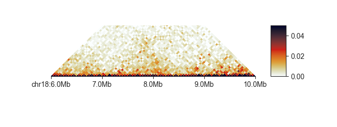
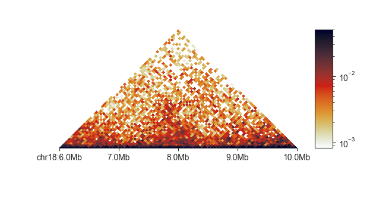
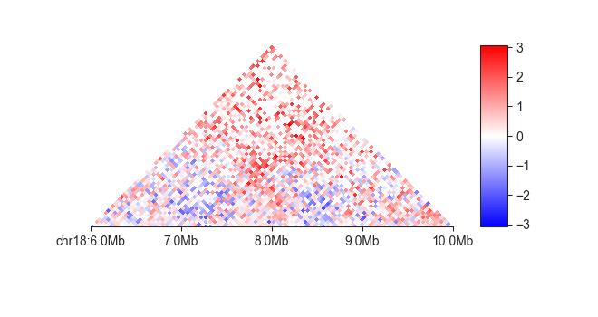
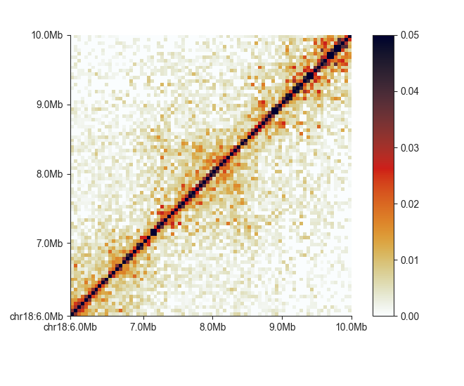

.. _matrix_panel_types:

==================
Matrix panel types
==================

This section will provide details about the different types of panels in the
command-line interface of ``fancplot``.

**********
triangular
**********

This is the common triangular heatmap plot used primarily for Hi-C data, but which
is compatible with all sort of input matrices, including difference and fold-change
comparisons. You simply provide it with a FAN-C compatible matrix file:

.. literalinclude:: code/panel_types_commands
    :language: bash
    :start-after: start snippet triangular basic
    :end-before: end snippet triangular basic

.. image:: images/fancplot_triangular_example.png

You often need to adjust the matrix saturation, to highlight different parts of the image.
You can do this interactively with ``-r``:

.. literalinclude:: code/panel_types_commands
    :language: bash
    :start-after: start snippet triangular range
    :end-before: end snippet triangular range

.. image:: images/fancplot_triangular_example_range.png

Or by explicitly setting a maximum saturation using ``-vmax``, in this case to ``0.05``.

You can truncate the triangle at a certain distance with ``-m`` for more compact plots:

.. literalinclude:: code/panel_types_commands
    :language: bash
    :start-after: start snippet triangular truncated
    :end-before: end snippet triangular truncated

You can also set the lower saturation values directly using ``-vmin``:

.. literalinclude:: code/panel_types_commands
    :language: bash
    :start-after: start snippet triangular vminvmax
    :end-before: end snippet triangular vminvmax

.. image:: images/fancplot_triangular_example_vminvmax.png

To change the default colormap use ``-c <matplotlib colormap>`` - any
`colormap in matplotlib <https://matplotlib.org/3.1.0/tutorials/colors/colormaps.html>`_
is supported.

.. literalinclude:: code/panel_types_commands
    :language: bash
    :start-after: start snippet triangular colormap
    :end-before: end snippet triangular colormap

.. image:: images/fancplot_triangular_example_colormap.png

You can change the color scale from linear to log using ``-l``:

.. literalinclude:: code/panel_types_commands
    :language: bash
    :start-after: start snippet triangular log
    :end-before: end snippet triangular log

By default, ``triangular`` plots normalised matrix data. You can turn this off
on the fly to plot uncorrected data using ``-u``:

.. literalinclude:: code/panel_types_commands
    :language: bash
    :start-after: start snippet triangular nonorm
    :end-before: end snippet triangular nonorm

.. image:: images/fancplot_triangular_example_nonorm.png

Similarly, you can convert the matrix on the fly to an observed/expected (O/E)
matrix using ``-e``. When using this option, the matrix values are automatically
log-2 transformed and the colorscale adjusts to a divergent colormap symmetrical
around 0.

.. literalinclude:: code/panel_types_commands
    :language: bash
    :start-after: start snippet triangular oe
    :end-before: end snippet triangular oe

******
square
******

This plot is the common square matrix plot. It has nearly the same options as
``triangle`` and uses the same syntax:

.. literalinclude:: code/panel_types_commands
    :language: bash
    :start-after: start snippet square basic
    :end-before: end snippet square basic

.. image:: images/fancplot_square_example.png

In addition to ``triangle``, ``square`` supports flipping the matrix upside-down
with ``-f``:

.. literalinclude:: code/panel_types_commands
    :language: bash
    :start-after: start snippet square flip
    :end-before: end snippet square flip

*****
split
*****

The ``split`` plot divides a heatmap along the diagonal to compare two matrices.
``split`` requires those matrices to be binned at the same resolution (or have identical
region definitions), as they are combined into a single merged matrix on the fly.
Besides providing two input matrices, one for the top and one for the bottom half
of the heatmap, the plot works in the same way as ``square``.

The plot assumes that the matrices are directly comparable and have been normalised to
the same sequencing depth. If this is not the case, you can scale the matrices using
the ``-s`` parameter, but note that this could potentially take a very long time.

******
mirror
******

The ``mirror`` plot is built from two triangular heatmaps, the bottom one is flipped
upside-down to give the effect of a reflection along the horizontal axis. This can be
used to compare different matrices, including the same Hi-C dataset binned at different
resolutions:

.. literalinclude:: code/panel_types_commands
    :language: bash
    :start-after: start snippet mirror basic
    :end-before: end snippet mirror basic

.. image:: images/fancplot_square_example_mirror.png

As this plot essentially consists of two ``triangular`` plots stapled together, the
parameters for the top and bottom plot can also be controlled independently. The
parameter names match those of the ``triangular`` plot, but with the ``u`` prefix
for the upper and ``l`` prefix for the lower plot:
``--uvmin``, ``--uvmax``, ``--uc``, ``--ue`` and
``--lvmin``, ``--lvmax``, ``--lc``, ``--le``.

Here is one more example showing a matrix and its O/E transformed version:

.. literalinclude:: code/panel_types_commands
    :language: bash
    :start-after: start snippet mirror oe
    :end-before: end snippet mirror oe

.. image:: images/fancplot_square_example_mirror_oe.png
