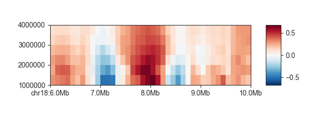
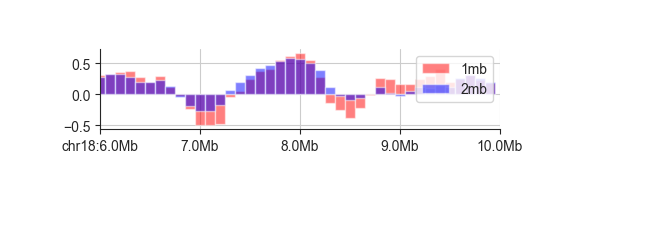
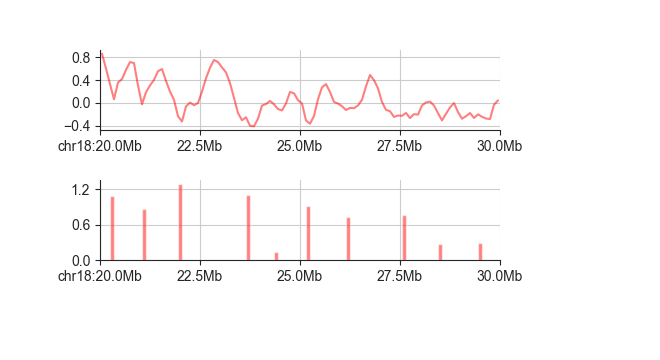

.. _region_pane_types:

============================
Region and Score panel types
============================

This section will introduce the panel types for region-based data, such as genomic
feature definitions or score tracks.

****
line
****

To visualise a single track of continuous scores, a simple ``line`` plot generally works very
well. This plot works on any file compatible with the :ref:`genomic_regions` interface, which
includes most of the common genomic data containers (BED, GFF, BigWig, Tabix, ...) and almost
all FAN-C objects.

.. literalinclude:: code/region_panel_types_commands
    :language: bash
    :start-after: start snippet line basic
    :end-before: end snippet line basic

.. image:: images/fancplot_line.png

When dealing with regions of variable size or if you want to emphasise that a value is assigned
to an interval rather than a single point, you can change the line style to a stepwise
representation using ``-s step``:

.. literalinclude:: code/region_panel_types_commands
    :language: bash
    :start-after: start snippet line step
    :end-before: end snippet line step

.. image:: images/fancplot_line_step.png

If you like, you can also fill the area between the horizontal line at 0 and the curve
using ``-f``

.. literalinclude:: code/region_panel_types_commands
    :language: bash
    :start-after: start snippet line fill
    :end-before: end snippet line fill

.. image:: images/fancplot_line_fill.png

Use ``-y`` to set the y axis limits

.. literalinclude:: code/region_panel_types_commands
    :language: bash
    :start-after: start snippet line limit
    :end-before: end snippet line limit

.. image:: images/fancplot_line_limit.png

You can control color and transparency of the line and its fill with ``-c`` and ``--alpha``,
respectively. By default, the alpha value is at ``0.5``. Any custom value must be between
``0`` and ``1``. To make the colors fully opaque, for example, use:

.. literalinclude:: code/region_panel_types_commands
    :language: bash
    :start-after: start snippet line color
    :end-before: end snippet line color

.. image:: images/fancplot_line_color.png

Transparency is especially useful when plotting multiple tracks in the same panels. You can
do this by simply adding more datasets.

.. literalinclude:: code/region_panel_types_commands
    :language: bash
    :start-after: start snippet line multi
    :end-before: end snippet line multi

.. image:: images/fancplot_line_multi.png

You can label datasets with ``-l``, which will add a legend to your plot. By default,
FAN-C will try to find a placement with minimum overlap to the plotted lines. If you prefer,
you can position the legend somewhere else using the ``--legend-location`` parameter.
Possible locations can be found
`here <https://matplotlib.org/3.1.1/api/_as_gen/matplotlib.pyplot.legend.html>`_.

.. literalinclude:: code/region_panel_types_commands
    :language: bash
    :start-after: start snippet line labels
    :end-before: end snippet line labels

.. image:: images/fancplot_line_labels.png

.. literalinclude:: code/region_panel_types_commands
    :language: bash
    :start-after: start snippet line legend
    :end-before: end snippet line legend

.. image:: images/fancplot_line_legend.png

******
scores
******

The ``scores`` panel type is designed for genome-wide, region-based scores, such as
the insulation score, that depend on a central parameter, such as a window size. It
represents scores in a heatmap, where each line corresponds to a different parameter
value, which allows a quick survey of scores without having to commit to a specific
parameter choice. It currently supports the :class:`~fanc.architecture.domains.InsulationScores`
and :class:`~fanc.architecture.domains.DirectionalityIndexes` objects, but can in
principle be extended to other data containers.

.. literalinclude:: code/region_panel_types_commands
    :language: bash
    :start-after: start snippet scores basic
    :end-before: end snippet scores basic

When your parameter represents a measure of base pairs, you can use the ``--genomic-format``
or ``-g`` parameter for a more abbreviated representation:

.. literalinclude:: code/region_panel_types_commands
    :language: bash
    :start-after: start snippet scores genomic
    :end-before: end snippet scores genomic

.. image:: images/fancplot_scores_genomic.png

As with regular matrix plots, you can control various plot parameters such as heatmap
color and saturation limits:

.. literalinclude:: code/region_panel_types_commands
    :language: bash
    :start-after: start snippet scores parameters
    :end-before: end snippet scores parameters

.. image:: images/fancplot_scores_parameters.png

***
bar
***

The bar plot can be used almost in exactly the same way as the line plot above, so we
recommend you read about ``line`` first. Here is an example:

.. literalinclude:: code/region_panel_types_commands
    :language: bash
    :start-after: start snippet bar example
    :end-before: end snippet bar example

However, ``bar`` may be most useful when dealing with sparse data that does not cover every
genomic interval. One example are domain boundaries. Here is a larger region of ``chr18``
showing all possible domain boundaries called from the insulation score (``fanc boundaries``).
The bar height corresponds to the boundary score:

.. literalinclude:: code/region_panel_types_commands
    :language: bash
    :start-after: start snippet bar boundaries
    :end-before: end snippet bar boundaries

.. image:: images/fancplot_bar_boundaries.png

This is especially useful in combination with the ``line`` plot of the insulation score, where
you can see exactly that each score minimum corresponds to a boundary call.:

.. literalinclude:: code/region_panel_types_commands
    :language: bash
    :start-after: start snippet bar combined
    :end-before: end snippet bar combined

*****
layer
*****

When you have a set of feature locations without an associated score, you can use a ``layer``
panel to visualise them (this also works for feature with scores, but they will be ignored).
Using the boundary locations above:

.. literalinclude:: code/region_panel_types_commands
    :language: bash
    :start-after: start snippet layer
    :end-before: end snippet layer

.. image:: images/fancplot_layer.png

As you can see, this will only plot the location of the provided features as rectangles - the
height is simply a consequence of the panel height and has no biological meaning. (Remember that
you can control the plot height using the ``--aspect-ratio`` argument).

Where the ``layer`` plot really shines, and where it gets its name from, is when dealing with
different feature types simultaneously. As an example, we have created a BED file that contains
both the domain boundaries called with a 1mb and a 2mb insulation score window. The 1mb boundaries
have ``1mb`` in the BED "name" field, while the 2mb boundaries appropriately have ``2mb``. The
name field is used by ``layer`` to divide features into rows:

.. literalinclude:: code/region_panel_types_commands
    :language: bash
    :start-after: start snippet layer bed
    :end-before: end snippet layer bed

.. image:: images/fancplot_layer_bed.png

****
gene
****

The feature plot is very versatile, but it cannot handle exon specifications and does not label
individual features. For that purpose, ``fancplot`` proves the ``gene`` panel. It is intended for use
with GFF files, such as can be obtained from Gencode, although it is in principle compatible with
any :ref:`genomic_regions` file (not fully tested). It is most efficient when the GFF files have been sorted
by chromosome and start coordinate, bgzipped and indexed with Tabix
(`here is an example <https://www.htslib.org/doc/tabix.html#EXAMPLE>`_ you can use for Tabix indexing)

