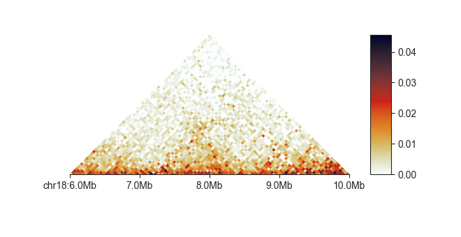

.. _klot-executable:

===========
Basic usage
===========

``klot`` is modular and multiple plots can be combined into a single figure.
Each plot can be configured individually, with a number of customisation options.

There are two modes: by default, an interactive plot opens in a new window,
which allows synchronised scrolling, zooming and panning for plots that support it.
By specifying an output file, the plot is saved to file directly.

********
Overview
********

.. argparse::
   :module: fanc.commands.klot_command_parsers
   :func: klot_parser
   :prog: klot
   :nodefault:

******************************************
Setting up the figure and plotting regions
******************************************

The main argument of ``klot`` is a region specification. You can list one or more
regions by region selector (of the form <chromosome>:<start>-<end>), or you can
provide the path to a file with region information (BED, GFF, FAN-C
object, ...). You can also mix the two. Regions will be plotted in the order they are
listed with the next plot appearing after the previous one has been closed.

.. literalinclude:: code/klot_example_commands
    :language: bash
    :start-after: start snippet klot regions
    :end-before: end snippet klot regions

By default, :code:`klot` plots exactly the area that is provided. It is, however,
also possible to merely center the plot on the provided region, and to set a fixed
plotting window using the ``-w`` option. This is especially useful when providing
regions from other analyses, such as ChIP-seq peaks or insulation boundaries,
and allows you to quickly survey other genomic features in their immediate surrounding.

.. literalinclude:: code/klot_example_commands
    :language: bash
    :start-after: start snippet klot window
    :end-before: end snippet klot window

By default, :code:`klot` will open an interactive plotting window. With the ``-o <path>``
argument, it is possible to directly plot to a file. The file ending determines its
type.

.. literalinclude:: code/klot_example_commands
    :language: bash
    :start-after: start snippet klot file
    :end-before: end snippet klot file

When specifying multiple regions, the output argument will be interpreted as a folder,
and each plot will be named by the pattern
``<region index>_[<prefix>_]_<chromosome>_<start>_<end>``. The ``<prefix>`` can be added
using the ``--name`` argument.

The figure width is controlled using the ``--width`` argument (4 inches by default).
The figure height is determined automatically from the figure width, the number of
panels, and their aspect ratio.

*************
Adding panels
*************

After setting up the figure and plotting region(s), you can start adding plots to the
figure. On the command line, the ``-p`` or ``--plot`` argument adds a new panel. You need
to provide the type of plot you want immediately after ``-p``:

.. literalinclude:: code/klot_example_commands
    :language: bash
    :start-after: start snippet klot panel
    :end-before: end snippet klot panel

A basic call to ``klot``, plotting a 4 Megabase region on chromosome 18 of a Hi-C matrix
in a triangular heatmap, could look like this:

.. literalinclude:: code/klot_example_commands
    :language: bash
    :start-after: start snippet klot triangular example
    :end-before: end snippet klot triangular example

``klot`` tries to find a sensible placement of ticks and ticklabels on the genome axis,
but if you prefer different tick locations or if labels are overlapping in small figures,
define your own custom labels with the ``--tick-locations`` argument.

.. literalinclude:: code/klot_example_commands
    :language: bash
    :start-after: start snippet klot triangular custom ticks
    :end-before: end snippet klot triangular custom ticks

.. image:: images/klot_triangular_example_custom_ticks.png

The first label will always get a chromosome prefix.

To get help on a specific panel type, and list available parameters, use ``-h`` after
the plot type:

.. literalinclude:: code/klot_example_commands
    :language: bash
    :start-after: start snippet klot panel help
    :end-before: end snippet klot panel help

*****************
Common parameters
*****************

A few parameters are supported by all panel types. For example, you can set a title above
a panel using the ``--title`` parameter.

You can format the genome axis in various ways. For example, add minor ticks between the
major ones on the genome axis using ``--show-minor-ticks``, or hide the major
ticks, too using ``--hide-major-ticks``. You can add a small legend to the panel showing
the distances between minor and major ticks, as well as the size of the plotting region
with ``--show-tick-legend``. You can hide the x axis altogether with ``--hide-x``.

The aspect ratio of each plot controls the height of the y axis relative to the width
of the x axis. For example, the default aspect ratio of the ``square`` plot is ``1.0``
while the default for ``triangular`` is automatically determined so that the matrix is
not distorted.

Sometimes there might be a nomenclature mismatch in the data backing different panels
regarding chromosome naming (with or without the ``chr`` prefix). Rather than having to
reformat your data to match with the plotting region definition, you can correct for
this issue on the fly, for each panel separately using ``--fix-chromosome``.

In the following sections we will introduce the different :ref:`panel_types` in more detail.