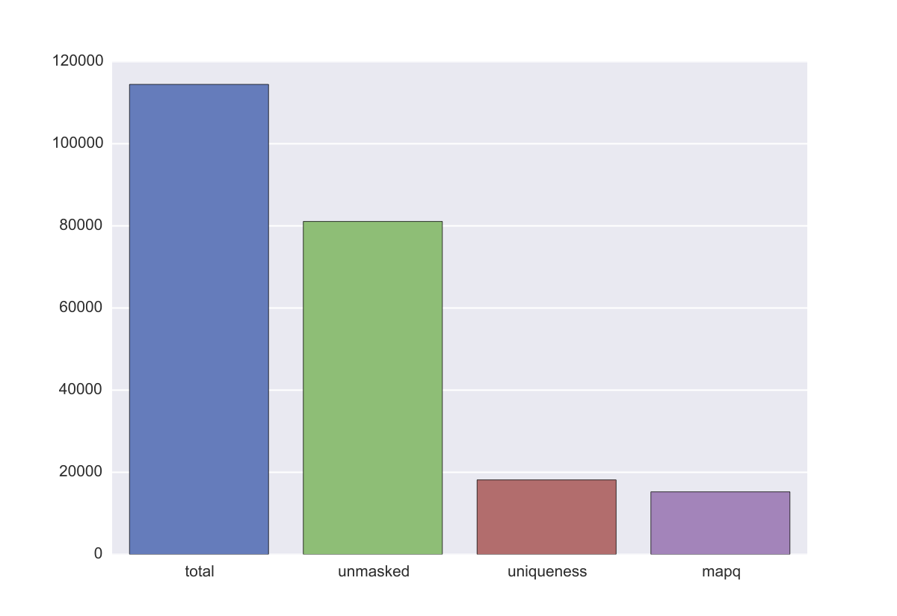

.. _kaic-executable:

============
kaic command
============

Kai-C provides a high-level executable (``kaic``) that can perform most Kai-C functions. Here
is its help screen, which you can see by running ``kaic -h``:

.. argparse::
   :module: kaic.commands.kaic_commands
   :func: kaic_parser
   :prog: kaic

``kaic``, like some other popular command-line tools such as ``git``, uses subcommands to do all of its
work. That means, the first argument to the ``kaic`` executable is the name of the command you want
to run. For example, ``kaic auto`` will invoke automatic processing of files in a Hi-C analysis. You can
get help on individual subcommands by simply appending ``-h`` to the command line call, e.g.
``kaic auto -h``.

.. _kaic-tmp:

***************
The -tmp option
***************

Many ``kaic`` commands have a ``-tmp`` option. This can be very useful if you are
working on a network file system (such as a cluster setup), where network I/O can become a bottleneck. With ``-tmp``,
all input files will be copied to a temporary folder (which typically is a local disk), and all output files will
equally be generated in that folder. On successful execution of the command, output files will be copied to their
"proper" destination and all temporary files will be cleaned up. Kai-C also tries to remove temporary files in
case of a premature termination of the command, but depending on the type of termination signal sent by your system,
this may not always work.

You can easily change the temporary folder by setting the ``$TMPDIR`` environment variable.

Automatic processing
~~~~~~~~~~~~~~~~~~~~

``kaic`` offers an automatic mode that will attempt to auto-detect the type of input files
(primarily by file extension) and
run a complete Hi-C pipeline up until the generation of bias-corrected Hi-C matrices.

.. argparse::
   :module: kaic.commands.kaic_commands
   :func: auto_parser
   :prog: kaic auto

Possible input files are:

*  **FASTQ/FASTQ.gz**, with sequencing reads will be iteratively mapped to a reference genome. Requires
   the additional argument ``-i`` (a Bowtie 2 genome index). The output will be processed further as
*  **SAM/BAM**, with mapped sequencing reads will be converted to an internal format ``.reads``
*  **Reads**, a ``kaic`` representation of aligned sequencing reads, will be filtered for alignment
   quality, uniqueness, and mappability. If multiple ``.reads`` files have been provided, it is assumed
   that any two pairs of files are the two halves of a mating pair, and these will be joined into
*  **Pairs**, a ``kaic`` representation of matched mating pairs. These will be filtered for mapping
   distance to the nearest restriction site, PCR duplicates, and ligation products indicating library
   issues. Requires the additional arguments ``-g`` (a reference genome) and ``-r`` (the name of a
   restriction enzyme). Any ``.pairs`` files will be converted into
*  **Hic**, a Hi-C matrix binned at the fragment level. Multiple ``.hic`` files will be merged. Once a
   single merged Hi-C fragment-level matrix remains,it will be binned at multiple resolutions, filtered
   for low sequencing coverage, and corrected for biases using Knight-Ruiz matrix balancing.

``kaic auto`` supports basic parallelisation, the number of threads can be controlled using the ``-t`` option.

Mapping
~~~~~~~

The start of every Hi-C pipeline is mapping of sequencing reads to a reference genome.

.. _iterative-mapping:

iterative_mapping
_________________

Iterative mapping truncates sequencing reads in a FASTQ file to a minimum read length and attempts to map them
to a reference genome using Bowtie 2. If a truncated read does not align uniquely and with a certain minimum
quality, it will be extended by a fixed number of bases (step size) and attempted to be mapped again. This process
is repeated until all reads have been mapped or the original read length has been reached.

Iterative mapping takes into account that many sequencing technologies suffer from a quality decay towards the
end of long reads. By truncating the read to a shorter length, the chance of a unique alignment unaffected by
the quality issues of full-length sequences is increased.

.. argparse::
   :module: kaic.commands.kaic_commands
   :func: iterative_mapping_parser
   :prog: kaic

Example use:

.. code:: bash

    kaic iterative_mapping /path/to/some.fastq /path/to/bowtie/index/prefix /path/to/output.sam -m 50 -s 5

Reads
~~~~~

Reads objects represent a list of mapped reads. ``kaic`` offers functionality to load reads from a SAM/BAM file and to
filter reads based on several mapping criteria.

.. _load-reads:

load_reads
__________

This command loads reads from a SAM file along with all their mapping properties.

.. argparse::
   :module: kaic.commands.kaic_commands
   :func: load_reads_parser
   :prog: kaic

The result is a Reads object, by convention these should have the ``.reads`` extension.

Example use:

.. code:: bash

    kaic load_reads /path/to/some.sam /path/to/output.reads

.. _filter-reads:

filter_reads
____________

This command can be used to filter reads in a Reads object that do not pass certain criteria.

.. argparse::
   :module: kaic.commands.kaic_commands
   :func: filter_reads_parser
   :prog: kaic

The ``-m`` option filters out all unmapped reads. The ``-u`` option filter reads with duplicate alignments of the same
quality to the reference genome, while ``-us`` filters reads if they have duplicate alignments regardless of quality.
With ``-q QUALITY`` it is possible to filter reads with a mapping quality lower than ``QUALITY``.

By adding the ``-s STATS`` option it is possible to get a PDF overview of the filtering process in a simple bar chart:

Example use:

.. code:: bash

    kaic filter_reads /path/to/original.reads /path/to/filtered.reads -m -us -q 30 -s /path/to/stats.pdf

Genome
~~~~~~

.. _build-genome:

build_genome
____________

This is a convenience function to assemble a genome object that can be used as input for some ``kaic`` commands
(for example the ``reads_to_pairs`` command).
Generally, it is easier to use FASTA files or folders, but importing large genomes that way can take a considerable
amount of time. If you find yourself using needing the same genome many times, pre-assembling a genome object
with this command can save computation time.

.. argparse::
   :module: kaic.commands.kaic_commands
   :func: build_genome_parser
   :prog: kaic

Pairs
~~~~~

A Pairs object represents pairs of mapped reads that have been assigned to regions in a reference genome. Typically,
regions are restriction fragments, which mark the lowest achievable resolution in a Hi-C experiment.

.. _load-pairs:

reads_to_pairs
______________

This command converts two (paired) Reads objects to a Pairs object by first identifying the genomic region each read
falls in, and then saving matching pairs of reads. It requires a reference sequence in FASTA format and the name of the
restriction enzyme used in the experiment.

.. argparse::
   :module: kaic.commands.kaic_commands
   :func: reads_to_pairs_parser
   :prog: kaic

The ``genome`` parameter is very flexible in its usage: To ensure that the regions in the final Hic object occur in the
desired order, it is recommended to use a comma-separated string with the paths of FASTA files with each chromosome
reference sequence.

Example:

.. code:: bash

    kaic reads_to_pairs /path/to/first.reads /path/to/second.reads /path/to/chr1.fa,/path/to/chr2.fa HindIII /path/to/output.pairs

.. _filter-pairs:

filter_pairs
____________

Similar to ``filter_reads``, this command filters pairs of mapped reads in a Pairs object.

.. argparse::
   :module: kaic.commands.kaic_commands
   :func: filter_pairs_parser
   :prog: kaic

The ``-i`` option can be used to filter *inward-facing* read pairs, while ``-o`` filter *outward-facing* reads at a
certain distance (see `Jin et al. 2013 <http://www.nature.com/nature/journal/v503/n7475/full/nature12644.html>`_).
``-r`` filters pairs where at least one read maps more than a certain distance to the nearest restriction site.

Example use:

.. code:: bash

    kaic filter_pairs /path/to/original.pairs /path/to/filtered.pairs -i 10000 -o 25000 -s /path/to/stats.pdf

Hic
~~~

The Hic object represents a Hi-C matrix. This includes both variable-region matrices, such as those based on restriction
fragments, and equi-distant regions, such as binned Hi-C matrices. It handles common tasks, such as binning or merging
Hic objects, and can be used to `plot <Plotting>`_ Hi-C data in a variety of ways.

.. _pairs-to-hic:

pairs_to_hic
____________

This command converts a Pairs object into a Hic object by summing up pairs with the same fragments and using that as
a weight (or contact count). The regions defined in the pairs object are transferred to the new object without changes,
i.e. the order of regions as defined in the `reads_to_pairs`_ command will be the order of regions along the axes of the
Hi-C matrix.

.. argparse::
   :module: kaic.commands.kaic_commands
   :func: pairs_to_hic_parser
   :prog: kaic

Example:

.. code:: bash

    kaic pairs_to_hic /path/to/my.pairs /path/to/new.hic

merge_hic
_________

Merges multiple Hic objects into one. The command will try to merge smartly, i.e. it should even work in cases where the
genomic regions differ between objects (for example when merging a chr1 with a chr2 matrix). In a first step, regions
will be merged and regions that exist in both matrices will be assigned new indices. In the second step, contacts will
be merged.

.. argparse::
   :module: kaic.commands.kaic_commands
   :func: merge_hic_parser
   :prog: kaic

Example:

.. code:: bash

    kaic merge_hic /path/to/old_1.hic /path/to/old2.hic /path/to/old3.hic /path/to/merged.hic

.. _bin-hic:

bin_hic
_______

This command bins regions in the genome into same-size chunks. The default strategy to distribute reads in the case of
old regions overlapping two or more regions in the binned Hic object is given by
`Rao et al. (2014) <http://www.cell.com/abstract/S0092-8674%2814%2901497-4>`_. Please note that, due to the nature of
the binning strategy, it is very likely that the last region in the genome is shorter than the requested bin size.

.. argparse::
   :module: kaic.commands.kaic_commands
   :func: bin_hic_parser
   :prog: kaic

Example to bin an existing object at 50kb resolution:

.. code:: bash

    kaic bin_hic /path/to/old.hic /path/to/binned.hic 50000

.. _filter-hic:

filter_hic
__________

You can use this command to filter Hi-C matrices.

.. argparse::
   :module: kaic.commands.kaic_commands
   :func: filter_hic_parser
   :prog: kaic

.. _correct-hic:

correct_hic
___________

You can use this command to correct Hic matrices using matrix balancing. By default, it uses the efficient matrix
balancing approach by `Knight and Ruiz (2012) <http://imajna.oxfordjournals.org/content/33/3/1029>`_, but providing the
``-i`` option switches to the iterative ICE method by
`Imakaev et al. (2012) <http://www.nature.com/nmeth/journal/v9/n10/full/nmeth.2148.html?WT.ec_id=NMETH-201210>`_.

.. argparse::
   :module: kaic.commands.kaic_commands
   :func: correct_hic_parser
   :prog: kaic

Sometimes it is not wanted to correct the entire matrix in one go, for example due to computer memory constraints or
the quality of inter-chromosomal data. In this case the ``-c`` option will cause the command to correct each
intra-chromosomal sub-matrix individually, leaving the inter-chromosomal data untouched.

Example use:

.. code:: bash

    kaic correct_hic /path/to/uncorrected.hic /path/to/corrected.hic

hic_pca
_______

If you have multiple biological and/or technical replicates for your Hi-C data, you might want to assess
their variability in a PCA analysis. ``hic_pca`` performs PCA on Kai-C ``Hic`` objects and gives you a number
of choices on how to pre-process and filter the data. The output comprises information on principal components,
explained variance, and PCA plots for the first and second principal components.

.. argparse::
   :module: kaic.commands.kaic_commands
   :func: hic_pca_parser
   :prog: kaic

Plotting (statistics)
~~~~~~~~~~~~~~~~~~~~~

``kaic`` provides a growing list of plotting commands to quickly assess the data at hand. Note that only
quality control plots are provided by ``kaic`` - for plotting genomic data sets, take a look at the much
more powerful ``klot`` command.

.. _plot-ligation-error:

plot_ligation_err
_________________

Plot the ligation error of mapped read pairs in a Pairs object. For an explanation of the different types of read pairs
see `Jin et al. (2013) <http://www.nature.com/nature/journal/v503/n7475/full/nature12644.html>`_. The point at which
the red and blue curves converge toward the dotted line can be used as a rough guideline for cutoffs in the
`filter_pairs`_ command.

.. argparse::
   :module: kaic.commands.kaic_commands
   :func: plot_ligation_err_parser
   :prog: kaic

``-p POINTS`` can be used to control the smoothing of the curve, but generally the auto-selected value provides a good
balance between smooting and detail.

Example:

.. code:: bash

    kaic plot_ligation_err /path/to/my.pairs /path/to/error.pdf

.. _restriction-distance:

plot_re_dist
____________

Use this plotting function to choose a cutoff for the restriction site distance filter in ``filter_pairs``. It
plots the distance of reads in a ``Pairs`` file to the nearest restriction site.

.. argparse::
   :module: kaic.commands.kaic_commands
   :func: plot_re_dist_parser
   :prog: kaic

plot_hic_corr
_____________

Plot the correlation between to ``Hic`` objects. Useful to compare replicates and for assessing similarity with
existing data sets.

.. argparse::
   :module: kaic.commands.kaic_commands
   :func: plot_hic_corr_parser
   :prog: kaic

plot_hic_marginals
__________________

Simplistic plot that shows the coverage (sum of all reads) per region/bin of the Hi-C map. Useful for selecting
a suitable cutoff for the minimum coverage in ``filter_hic``.

.. argparse::
   :module: kaic.commands.kaic_commands
   :func: plot_hic_marginals_parser
   :prog: kaic

Network Analysis
~~~~~~~~~~~~~~~~

This group of commands is built around the peak calling methodology for Hi-C data developed by
`Rao et al. (2014) <http://www.cell.com/abstract/S0092-8674%2814%2901497-4>`_. You will find methods
for peak calling, merging, and filtering.

call_peaks
__________

Highly parallel peak calling implementation based on local enrichment of contacts (Rao et al. 2014).
If a grid engine environment is available (SGE or OGE), it will send enrichment calculations to the
grid. For this, ``call_peaks`` internally uses `gridmap <https://github.com/pygridtools/gridmap>`_ -
be sure to read their documentation to configure your local environment successfully. Especially,
you might want to tweak the
`configuration options <http://gridmap.readthedocs.io/en/latest/gridmap.html#module-gridmap.conf>`_
for your system.

.. argparse::
   :module: kaic.commands.kaic_commands
   :func: call_peaks_parser
   :prog: kaic

filter_peaks
____________

Filter the potential peaks by various criteria, such as minimum enrichment per neighborhood, FDR, etc.
Also provides an option to use the similar filtering criteria as in the original publication (``-r`` option).

.. argparse::
   :module: kaic.commands.kaic_commands
   :func: filter_peaks_parser
   :prog: kaic

merge_peaks
___________

Merge nearby peaks that have passed the filtering step.

.. argparse::
   :module: kaic.commands.kaic_commands
   :func: merge_peaks_parser
   :prog: kaic

filter_merged_peaks
___________________

One more filtering step for merged peaks. Currently only allows filtering as done in the original publication,
i.e. isolated peaks and peaks that have an FDR sum larger than .02 are removed.

.. argparse::
   :module: kaic.commands.kaic_commands
   :func: filter_merged_peaks_parser
   :prog: kaic

Architecture
~~~~~~~~~~~~

This group of commands provides analysis tools for architectural features of individual Hi-C matrices
and comparisons between matrices.

fold_change
___________

Calculate the fold-change between two Hi-C matrices, for each individual pair of regions. The ouput is a
matrix object in which the weight is the ratio of the two matrices. By default, input matrices are scaled to contain
the same number of "reads" (or normalised reads) before calculating the ratio (this can be switched off with ``-S``).
It may be useful to log2-transform the output (``-l``) to have a symmetric scale of values.

.. argparse::
   :module: kaic.commands.kaic_commands
   :func: fold_change_parser
   :prog: kaic

insulation
__________

Calculate the insulation index for a Hi-C or FoldChange object. Insulation index definition from
`Crane et al. 2015 <http://www.nature.com/nature/journal/v523/n7559/full/nature14450.html>`_. In addition,
``kaic`` also provides methods to normalise the and modify index in different ways. You can specify multiple
window sizes at once, which can be useful to find robust parameter regions. The output is an InsulationIndex
object, which can serve as input for other commands and methods.

.. argparse::
   :module: kaic.commands.kaic_commands
   :func: insulation_parser
   :prog: kaic

boundaries
__________

Find insulated boundaries from insulation index results. Identifies minima in the insulation index and scores
them by the difference in height the the nearest extremum. You can filter boundaries by score before they are
written to a BED file.

.. argparse::
   :module: kaic.commands.kaic_commands
   :func: boundaries_parser
   :prog: kaic

diff
____

Calculate the difference between two vectors, for example the difference between to InsulationIndex objects.
Useful for comparing the architecture of two Hi-C matrices.

.. argparse::
   :module: kaic.commands.kaic_commands
   :func: diff_parser
   :prog: kaic

directionality
______________

Calculate the `directionality index <http://www.nature.com/nature/journal/v485/n7398/abs/nature11082.html>`_
for a Hi-C object (Dixon et al. 2012).

.. argparse::
   :module: kaic.commands.kaic_commands
   :func: directionality_parser
   :prog: kaic

average_tracks
______________

Mix between ``directionality`` and ``insulation``. Uses two rectangular sliding windows (instead of a quadratic one),
one to the left and one to the right of the region. Windows are defined by offset from region, window size
(rectangle height) and padding (rectangle width). Can provide more fine-grained control over the sought features.

.. argparse::
   :module: kaic.commands.kaic_commands
   :func: average_tracks_parser
   :prog: kaic

Other
~~~~~

optimise
________

Optimise a Hi-C object for faster access. Will improve access speed by an order of magnitude.

.. argparse::
   :module: kaic.commands.kaic_commands
   :func: optimise_parser
   :prog: kaic

subset_hic
__________

.. argparse::
   :module: kaic.commands.kaic_commands
   :func: subset_hic_parser
   :prog: kaic

write_config
____________

Write the default kaic configuration to a file. Place this file in your home folder as ``.kaic.conf``, where it
can be found by the kaic library.

.. argparse::
   :module: kaic.commands.kaic_commands
   :func: write_config_parser
   :prog: kaic

