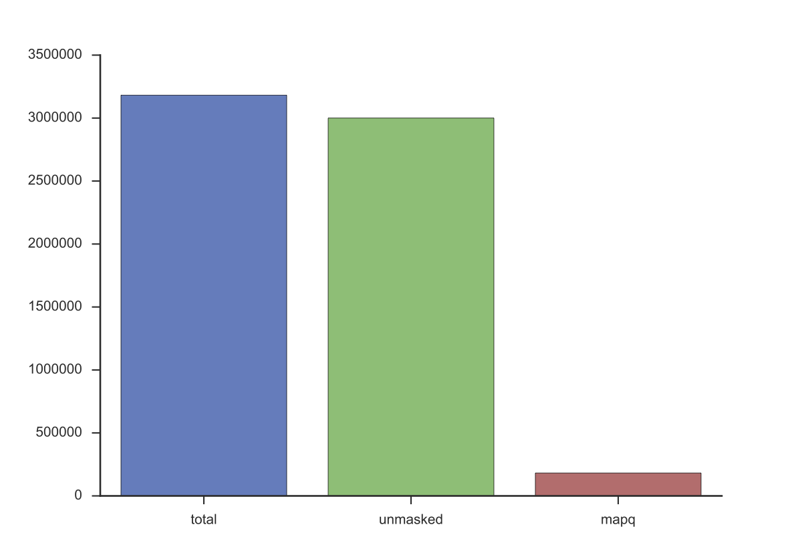
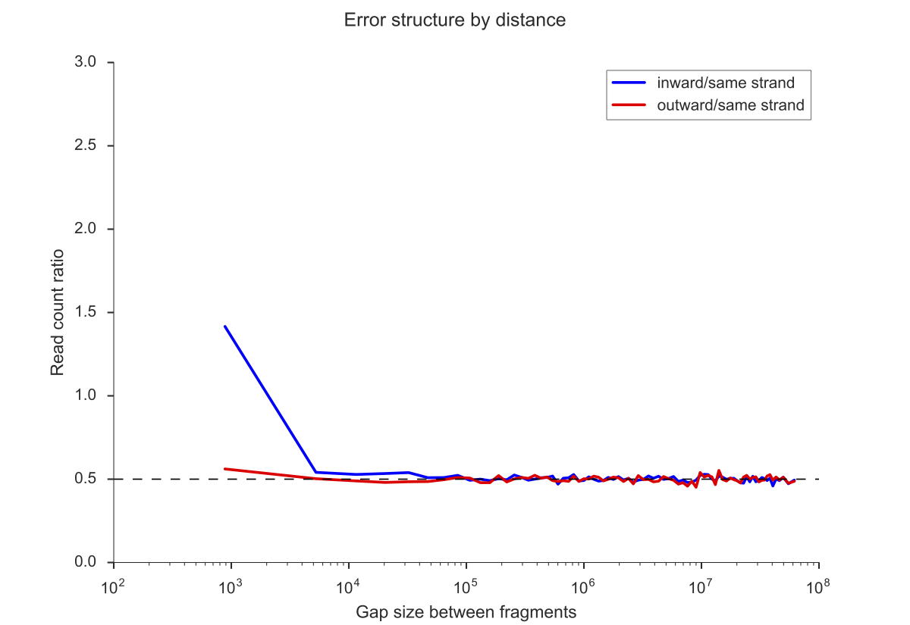
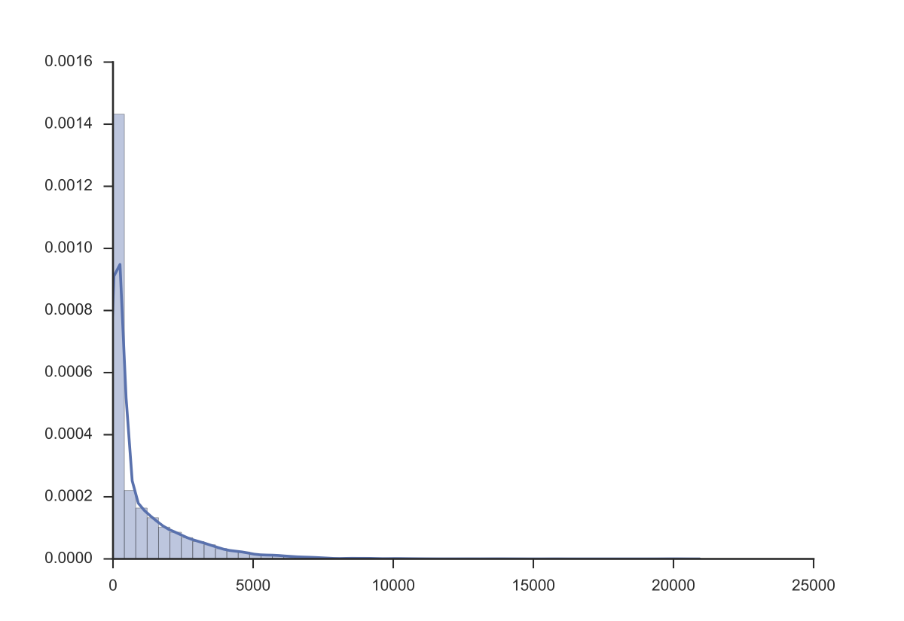
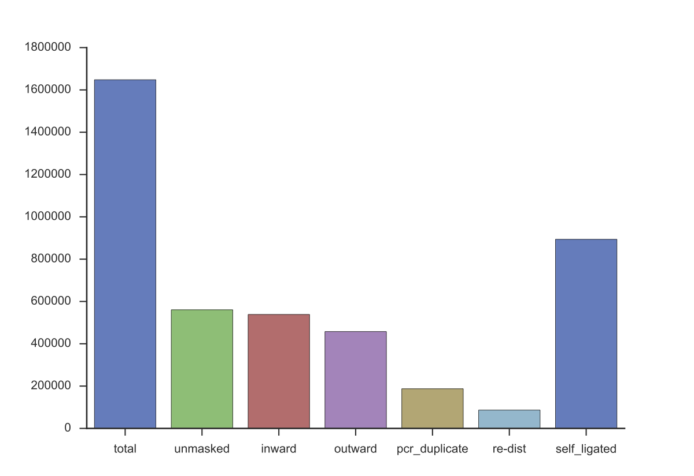

.. include:: ../symbols/isonum.txt

.. _modular-analysis:

################
Modular analysis
################

In :ref:`example-kaic-auto`, we created bias-corrected Hi-C maps at multiple resolutions
from FASTQ files in a single step. Here, we will manually execute every step from ``kaic-auto`` to demonstrate
the customisation capabilities of ``kaic``. We will be using the example files in the  ``kaic/test/examples/``
folder on our `GitHub page <http://www.github.com/vaquerizaslab/kaic>`_.

For convenience, in this tutorial we will use ``kaic dirs`` to create standard output folders, but of course
you are free to write files to whichever folder you like. For all commands, I assume your current working
directory is the ``kaic`` examples folder. The command

.. code:: bash

   kaic dirs auto_output/

generates the folder hierarchy

.. code::

    auto_output/
        fastq/
        hic/
            binned/
            corrected/
            filtered/
        pairs/
            filtered/
        plots/
            matrix/
            stats/
        reads/
            filtered/
        sam/

The first step to convert the sample FASTQ files to a Hi-C matrix is then to map the reads to a reference genome.

****************
FASTQ |rarr| SAM
****************

You are free to map sequencing reads to the reference genome with any mapper of your choice. For convenience,
Kai-C implements a mapping strategy using Bowtie 2 that is particularly well suited to Hi-C: *iterative mapping*.
In this strategy, a read will be truncated to different lengths and mapped against the reference genome until
a unique alignment can be found. Should no unique alignment exist, the read won't be reported as mapping.

The command for this is ``kaic iterative_mapping`` (see :ref:`iterative-mapping`).

.. code:: bash

   kaic iterative_mapping SRR4271982_chr18_19_1.fastq.gzip SRR4271982_chr18_19_2.fastq.gzip auto_output/sam/ -i hg19_chr18_19/hg19_chr18_19 -s 20 -t 4

This will (iteratively) map the files `SRR4271982_chr18_19_1.fastq.gzip` and `SRR4271982_chr18_19_2.fastq.gzip`
against the Bowtie 2 index `hg19_chr18_19/hg19_chr18_19`. The output file names will be chosen automatically as
`SRR4271982_chr18_19_1.bam` and `SRR4271982_chr18_19_2.bam` and places in the folder `auto_output/sam`. If you prefer
to output to uncompressed SAM, run the above command on each FASTQ file individually and then specify a path
that ends with `.sam` as the output parameter, for example:

.. code:: bash

   kaic iterative_mapping SRR4271982_chr18_19_1.fastq.gzip auto_output/sam/SRR4271982_chr18_19_1.sam -i hg19_chr18_19/hg19_chr18_19 -s 20 -t 4

You can control the minimum length of a read with ``-m`` and the extension size with ``-s``.

Internally, Kai-C will split the FASTQ file into smaller chunks (controlled by the ``-b`` parameter). By default, each
chunk will be mapped to the reference genome by a separate Bowtie 2 process - this is a fast, but memory-intensive
way of parallelisation. A slightly slower, but more memory-efficient way can be triggered by using the
``--bowtie-parallel`` option, which will utilize Bowtie 2s builtin parallelisation. However, output processing
will then take place in a single thread (hence the slowdown).
Set the number of parallel threads with ``-t``.

A mapped read will be sent to another iteration if it does not map uniquely or if its mapping
quality is lower than the parameter specified with ``-q``. In the end, the best unique alignment will be reported -
also if the quality is lower than ``-q``.

It is common in Hi-C to sequence fragments that contain a ligation junction, and such reads are difficult to map.
Usually, the truncation in the iterative mapping process has a good chance
of removing the ligation junction, increasing the chance of a read being mapped, but you may want to explicitly
truncate a read at a ligation junction, if it has one, before attempting an alignment. To do so, simply
specify the name of the restriction enzyme used in the Hi-C experiment with the ``-r`` option (case sensitive).
Kai-C will determine the ligation junction automatically and remove them prior the the iterative mapping procedure.

If you are using the ``-tmp`` option (see :ref:`kaic-tmp`), and have limited space on your ``tmp`` partition, you may
also be interested in the ``--split-fastq`` option. This will split FASTQ files in the local output folder *before*
copying them over with ``-tmp``, thus saving disk space (but being a lot slower).

****************
SAM |rarr| Reads
****************

Kai-C uses an internal representation of aligned reads, which we will call Reads. This representation is optimised
for fast sorting, and - more importantly - enables a number of convenient filtering options to control the quality
of mapped reads. To convert the SAM files to Reads objects (see :ref:`load-reads`), run:

.. code:: bash

   kaic load_reads auto_output/sam/SRR4271982_chr18_19_1.bam auto_output/reads/SRR4271982_chr18_19_1.reads -D
   kaic load_reads auto_output/sam/SRR4271982_chr18_19_2.bam auto_output/reads/SRR4271982_chr18_19_2.reads -D

All optional flags control how much information is loaded into the object. With the ``-D`` option, the read's qname,
sequence, and quality string won't be saved. (The qname will internally be converted into an integer representation
so that paired reads can still be matched up).

Next, Reads are filtered using the :ref:`filter-reads` command:

.. code:: bash

   kaic filter_reads auto_output/reads/SRR4271982_chr18_19_1.reads auto_output/reads/filtered/SRR4271982_chr18_19_1.reads -q 30 -m -us -s auto_output/plots/stats/SRR4271982_chr18_19_1.reads.stats.pdf
   kaic filter_reads auto_output/reads/SRR4271982_chr18_19_2.reads auto_output/reads/filtered/SRR4271982_chr18_19_2.reads -q 30 -m -us -s auto_output/plots/stats/SRR4271982_chr18_19_2.reads.stats.pdf

Like this, only aligned (``-m``), uniquely mapping reads (``-us``) with a quality larger than 30 (``-q 30``) are kept.
It is possible to relax the uniquely mapping criterium a bit, by using the ``-u`` instead of the ``-us`` option,
which will filter reads only if they have a second alignment that is as good as the first, instead of any second
alignment.

If you have strong risk of contamination in your sample, for example if you have isolated pathogen from blood, you can
filter the Reads file using a second Reads file wth reads aligned against the contaminant reference genome. This will
filter out all reads that occur in both objects.

To collect statistics on the filtering process, specify the path to a PDF file using the ``-s`` option. The output will
look like this:

The blue and green bars denote *before* and *after* filtering, respectively. The remaining bars together with
the green bar do not necessarily add up to the height of the blue bar, as a single read can be "caught" by multiple
filters.

******************
Reads |rarr| Pairs
******************

Now that we have filtered at the read level, we can pair up the remaining reads to form read pairs. At the same time,
we will map reads to restriction fragments, which again enables more filtering options (on the read pair level)
and prepares the Hi-C matrix generation step. To form read pairs use the :ref:`load-pairs` command:

.. code:: bash

   kaic reads_to_pairs auto_output/reads/filtered/SRR4271982_chr18_19_1.reads auto_output/reads/filtered/SRR4271982_chr18_19_2.reads hg19_chr18_19.fa HindIII auto_output/pairs/example.pairs

All parameters, except the ``-tmp`` option, are mandatory. They are: the two filtered Reads objects from the previous
command's output, the reference genome in FASTA format, the restriction enzyme of this study (HindIII), and the
output file.

Importantly, the regions in the final Hi-C matrix will be arranged in the order of regions in the supplied genome.
Instead of a single FASTA file, you can also concatenate multiple files (e.g. chromosomes) by supplying a list
of files at this step (comma-separated, no spaces). This gives you more control over the order of sequences. The genome
will be used to identify restriction fragments. This process may take a while, and if you are building a lot of
Hi-C matrices from the same genome, you may want to use a pre-built object using the :ref:`build-genome` command.

Hi-C experiments are prone to a lot of biases, and Kai-C supplies several quality control plots to identify them
and find suitable filtering parameters. `Jin et al. (2013)
<http://www.nature.com/nature/journal/v503/n7475/abs/nature12644.html>`_ have identified several errors that
stem from incomplete digestion and which can be identified from different types of ligation products. To plot these
biases use :ref:`plot-ligation-error`:

.. code:: bash

   kaic plot_ligation_err auto_output/pairs/example.pairs auto_output/plots/stats/example.pairs.ligation_error.pdf

Use the convergence of the red (*outward* ligation error) and blue (*inward* ligation error) lines to 0.5 as
cutoffs for the filtering process.

Sequenced fragments typically underwent a size selection process, and unusually large fragments can be filtered out.
To plot the distribution of restriction site distances of mapped reads, use :ref:`_restriction-distance`:

.. code:: bash

   kaic plot_re_dist auto_output/pairs/example.pairs auto_output/plots/stats/example.pairs.re_dist.pdf

Similar to Reads, Pairs objects can be filtered according to several criteria. To filter the Pairs object from
the above output, use the :ref:`filter-pairs` command:

.. code:: bash

   kaic filter_pairs --auto -r 5000 -l -d 2 auto_output/pairs/example.pairs auto_output/pairs/filtered/example.pairs -s auto_output/plots/stats/example.pairs.stats.pdf

This filters out all read pairs that have a restriction site distance larger than 5000bp (``-r 5000``), that represent
self-ligated fragments (``-l``), that have a high likelihood of being ligation errors (``--auto``, see above),
and that are highly likely to be PCR duplicates (``-d``). The latter option requires a parameter that determines
when mapping locations of reads are considered identical. ``-d 2`` means two read pairs are considered PCR duplicates,
when each pair maps to the same locations with a tolerance of 2bp per half. ``--auto`` automatically, but perhaps a
little conservatively, chooses cutoffs for ligation errors. You can override these using the ``-o`` and ``-i`` options.

The file ``auto_output/plots/stats/example.pairs.stats.pdf`` contains an overview of the filtering process, similar
to the Reads case above:

****************
Pairs |rarr| Hic
****************

From the filtered read pairs in the Pairs object it is only a small step to a fragment-level Hi-C matrix. To
convert the Pairs object into a "Hic" object, use :ref:`pairs-to-hic`:

.. code:: bash

   kaic pairs_to_hic auto_output/pairs/filtered/example.pairs auto_output/hic/example.hic

We need no further options, as information about the reference genome and restriction fragments are already
stored in the Pairs object. This will produce a fragment-level Hic object by counting the number of read pairs between
each fragment pair. This object will be the basis for binned Hi-C matrices.

Binning a Hi-C matrix into equidistant regions is just as simple. ``kaic auto`` will automatically bin at multiple
resolutions, here we will demonstrate binning at 50kb using :ref:`bin-hic`:

.. code:: bash

   kaic bin_hic auto_output/hic/example.hic auto_output/hic/binned/example_50kb.hic 50000

As always, you are free to choose whatever file name you want.

Before we come to the last step - matrix correction - we recommend filtering the Hi-C matrix for low coverage bins.
You may also want to remove reads at the diagonal before correction. Both can be achieved using the :ref:`filter-hic`
command:

.. code:: bash

   kaic filter_hic auto_output/hic/binned/example_50kb.hic auto_output/hic/filtered/example_50kb_filtered.hic -ld -s auto_output/plots/stats/example_50kb_filtered.stats.pdf

Here, the ``-ld`` option filters low-coverage bins if they have less than 10% of the median number of reads
per bin. Sometimes you can also achieve better correction results by removing the reads along the diagonal of the
matrix. Use ``-d 1``, for example, to filter reads up to one bin away from the diagonal.

You can check the results in the summary PDF ``auto_output/plots/stats/example_50kb_filtered.stats.pdf``.

.. image:: images/example_50kb_filtered.stats.png
   :width: 500pt

Finally, the last step in the Hi-C matrix generation is matrix correction. Kai-C offers two different matrix balancing
methods: Knight-Ruiz matrix balancing and ICE correction. You can correct a Hi-C matrix using :ref:`correct-hic`:

.. code:: bash

   kaic correct_hic auto_output/hic/filtered/example_50kb_filtered.hic auto_output/hic/corrected/example_50kb_filtered_pc.hic -c

By default, ``kaic correct_hic`` chooses Knight-Ruiz matrix balancing. The ``-c`` option corrects each intra-chromosomal
matrix independently and does not correct inter-chromosomal data. Whole-matrix correction requires a lot of memory, and
will be omitted for this tutorial.

And that is it, the final result is a bias-corrected Hi-C matrix. The corresponding file can be used as input for a
score of analysis methods. Go to :ref:`kaic-analysis` for the next steps in this tutorial.