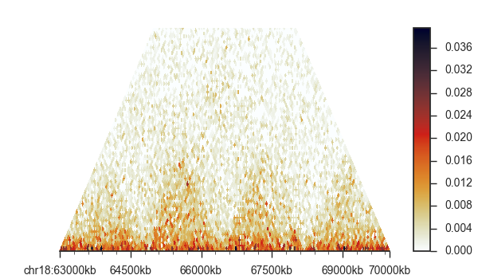

###############
Getting started
###############

.. contents::
   :depth: 2

Kai-C offers access to its Hi-C processing pipeline on multiple levels, including
a high-level executable and a low-level Python 2.7.x / 3.5.x API. Often the ``kaic``
executable will cover the analysis needs of basic users. For more advanced use cases, the API
is available, which gives maximum flexibility with regards to
integration of other data sets and custom analysis methods. The output of the command line tool
is fully compatible with the API.

************
Installation
************

Before installing Kai-C, make sure you have all the prerequisites installed in your system.
Specifically, Kai-C uses the HDF5 (via PyTables), a file format that simplifies the storage and access to huge
amounts of data. The minimum required version is 1.8.4, but we recommend installing the latest version.

Prerequisite: HDF5
==================

If you are on Linux, download the source code of the latest version from
the `HDF5 website <https://www.hdfgroup.org/HDF5/>`_ and unpack it.
There are two different HDF5 branches - note that the 1.10.x branch is not supported!

.. code:: bash

   # make a new directory
   mkdir hdf5-build
   cd hdf5-build
   # replace xx with current version number
   wget https://support.hdfgroup.org/ftp/HDF5/current/src/hdf5-1.8.xx.tar.gz
   # unpack
   tar xzf hdf5-1.8.xx.tar.gz
   cd hdf5-1.8.xx/
   # use --prefix to set the folder in which HDF5 should be installed
   # alternatively, you can omit --prefix=... here and run
   # sudo make install to install globally (requires admin rights)
   ./configure --prefix=/path/to/hdf5/dir
   make
   make install

If you are on OS X or macOS, we highly recommend using the fantastic `Homebrew <http://brew.sh/>`_.
Then you can simply:

.. code:: bash

   brew tap homebrew/science
   brew install hdf5

To ensure that PyTables, the Python library that uses HDF5, finds the correct HDF5 version, we
need to set an environment variable pointing to the installation directory:

.. code:: bash

   # on Linux, this is the same /path/to/hdf5/dir that you used above
   # on macOS, this is wherever brew installs its recipies (typically /usr/local/Cellar)
   #   - you can find this by running 'brew info hdf5'
   export HDF5_DIR=/path/to/hdf5/dir

Kai-C
=====

The simplest way to install Kai-C is via pip:

.. code:: bash

   pip install kaic

and that should be all you need! If you are not the owner of the Python installation,
try:

.. code:: bash

   pip install --user kaic

You can also directly download the Kai-C source code from Github by cloning its repository.
The installation is then done via setup.py:

.. code:: bash

   git clone http://www.github.com/vaquerizaslab/kaic
   cd kaic
   python setup.py install

Kai-C can now be accessed via command line (``kaic`` for analysis, ``klot`` for plotting) or as a Python 2.7.x / 3.5.x
module (``import kaic``).

.. _example-kaic-auto:

**********************************
Example: Basic, automated analysis
**********************************

For this example, we are going to use the command ``kaic auto`` (see :ref:`kaic-auto`) to construct a Hi-C map
from a subset of a previously published adrenal tissue data set
(`SRR4271982 of GSM2322539 <https://www.ncbi.nlm.nih.gov/geo/query/acc.cgi?acc=GSM2322539>`_). You can access the
sample and all necessary files in the ``kaic/test/examples/`` folder on our `GitHub page
<http://www.github.com/vaquerizaslab/kaic>`_.

From the examples folder, run:

.. code:: bash

   kaic auto SRR4271982_chr18_19_1.fastq.gzip SRR4271982_chr18_19_2.fastq.gzip auto_output/ -g hg19_chr18_19.fa -i hg19_chr18_19/hg19_chr18_19 -n example -s 20 -t 4 -r HindIII

On a modern desktop computer with at least for computing cores the command should take less than an hour to finish.
It will generate several binned, bias-corrected Hi-C matrices from the FASTQ input.

Input
=====

The input files (``SRR4271982_chr18_19_1.fastq.gzip`` and ``SRR4271982_chr18_19_2.fastq.gzip``) in this example
are gzipped FASTQ files. As these will be processed into Hi-C matrices, the FASTQ files
have to be paired-end. It is also possible to feed ``kaic`` more FASTQ files as input, as long as they are an even
number. In general, ``kaic auto`` accepts a large number of file types (detailed in :ref:`kaic-auto`), and will choose
appropriate processing steps automatically.

The output folder for all processing steps (``auto_output/``) is relative to the current working directory and
will be generated if it doesn't exist.

The following are options that enable and affect Hi-C matrix generation from FASTQ files:

**-g hg19_chr18_19.fa**

This parameter specifies the genome to be used. Typically, this will be a FASTA file that *only* contains identifiers
and sequences of the chromosomes you want in the Hi-C map - no unassembled contigs, etc. In this particular case,
``hg19_chr18_19.fa`` contains the chromosomes 18 and 19 of the human genome assembly hg19. Alternatively, you can
specify a comma-separated list of fasta files (for more control over the order of sequencesO, or a folder with
fasta files (order selected randomly). There is also a small helper function (:ref:`build-genome`) to assemble
genome objects, if you find yourself using the same genome many times.

**-i hg19_chr18_19/hg19_chr18_19**

This should be the Bowtie 2 reference genome index. In this case, we built a smaller index from just the two chromosomes
18 and 19 of hg19 to speed up the example run.

**-n example**

A prefix for the output files, including the Hi-C objects.

**-s 20**

Step size for iterative mapping. When supplying FASTQ files, reads are first truncated to a smaller size (25bp, can be
changed by the -m parameter), and then iteratively extended by 20 base pairs until a unique mapping can be found or
the full length of the read is reached. This increases the mappability of reads.

**-t 4**

Number of parallel processes to be used by ``kaic auto``. Not every step can be parallelised, especially if it
involves disk I/O, but steps like iterative mapping benefit a lot from additional processes.

**-r HindIII**

The restriction enzyme used in the Hi-C experiment. This parameter is case sensitive, and will be used to identify
restriction sites in the genome.

Output
======

The output is structured into several subfolders, containing the output files of each individual kaic subcommand.

**sam**

This folder will contain the results of the iterative mapping in compressed BAM format.

**reads** and **reads/filtered**

Aligned reads will be loaded into the ``kaic``-internal Reads format. It is a SAM-equivalent format that enables
filtering of Reads based on several criteria, such as mapping quality and uniqueness. Filtered Reads are kept in the
reads/filtered folder. In the example, only uniquely
mapping reads were left after the iterative mapping, and hence reads were only filtered for mapping quality > 30.

**pairs** and **pairs/filtered**

Aligned reads are combined into matching pairs and assembled into a Pairs file and automatically assigned to
restriction fragments in the reference genome. Pairs are then filtered for restriction site distance, PCR
duplicates, self-ligations, and other types of ligation errors (see
`Jin et al. 2013 <http://www.nature.com/nature/journal/v503/n7475/full/nature12644.html>`_)

**hic**, **hic/binned**, **hic/filtered**, and **hic/corrected**

After the pair assembly and filtering steps, read pairs mapping to specific fragments are counted and assembled
into a fragment-level Hi-C map (``hic`` folder). This map is then binned with bin sizes ranging from 5Mb to 5kb.
Binned Hi-C maps are finally bias-corrected using the Knight-Ruiz matrix balancing algorithm.

**plots/stats**

This folder contains plots with filtering information and other statistics. These plots can be useful as
quality control or to choose better parameters for filtering steps, etc.

Plotting
========

Finally, we can plot the newly generated Hi-C maps easily using the ``klot`` command. Simply execute

.. code:: bash

   klot chr18:63000000-70000000 -p -t hic auto_output/hic/corrected/example_50kb_corrected_pc.hic

This will plot the region 63-70Mb of chromosome 18 in the familiar Hi-C plot. Note that this dataset is very small
and hence the quality of the matrix not particularly great - but TADs are clearly visible.

Next steps
==========

The ``kaic auto`` analysis is convenient, but doesn't allow for a lot of customisation. If you need more control, such
as an adjustment of the different filtering steps, different matrix resolutions, etc., you can run every part of
the Hi-C matrix generation individually and customize it to your needs (see :ref:`modular-analysis` and
:ref:`kaic-executable`).

