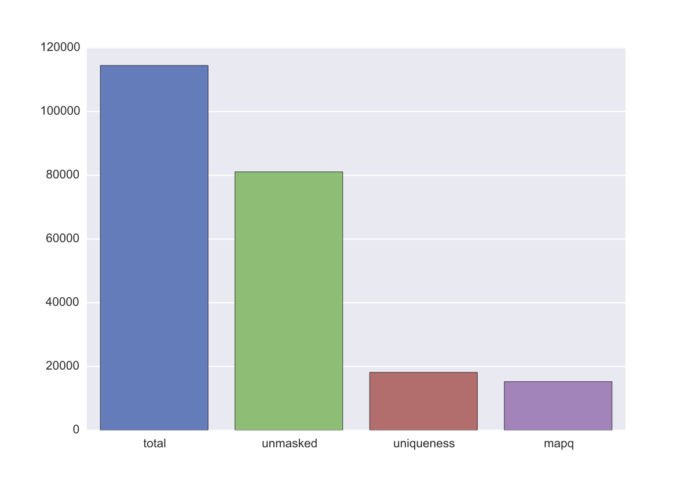

===============
Getting started
===============

.. contents::
   :depth: 2

Kai-C offers access to its Hi-C processing pipeline on multiple levels, including
a high-level executable and a low-level Python 2.7 API. Often the ``kaic``
executable will cover the analysis needs of basic users, but its output is
compatible with the API, which gives maximum flexibility with regards to
integration of other data sets and custom analysis methods.

Installation
------------

You can download the Kai-C source code from GitLab by cloning its repository.

.. code:: bash

  git clone http://www.github.com/vaquerizaslab/kaic

kaic depends on several python packages which should mostly be installed
automatically during the installation process.

However, one core dependency is not installed automatically:
`PyTables <https://github.com/PyTables/PyTables>`_ is currently on version 3.2.2
and there is a critical bug affecting kaic performance that will be fixed in
version 3.3. To circumvent the bug, it is highly recommended to install the
PyTables development version. (Note: The kaic installer will now attempt to install
this directly).

PyTables depends on the `HDF5 <https://www.hdfgroup.org/HDF5/>`_ library. To
install the latest version it is easiest to use Homebrew (on OS X) or Linuxbrew.

.. code:: bash

  brew install hdf5

Or you can install
`from source <https://www.hdfgroup.org/HDF5/release/obtain5.html>`_.

To ensure this version of HDF5 is used during the installation of PyTables, set
the HDF5_DIR environment variable to the path of your HDF5 installation.

Then install PyTables:

.. code:: bash

  pip install git+https://github.com/PyTables/PyTables.git

or if you do not have root access to the Python installation:

.. code:: bash

  pip install --user git+https://github.com/PyTables/PyTables.git

Finally, from the root directory of kaic do

.. code:: bash

  pip install .

or, if you don't have permissions to install packages globally:

.. code:: bash

  pip install --user .

Command-line executable
-----------------------

kaic provides a high-level executable that can perform most kaic functions. Here
is its help screen, which you can see by running ``kaic -h``:

.. code:: bash

   usage: kaic <command> [options]

   Commands:
       auto                Automatically process an entire Hi-C data set
       dirs                Create default folder structure for kaic
       stats               Get statistics for kaic pipeline files

       --- Mapping
       iterative_mapping   Iteratively map a FASTQ file to a Bowtie 2 index

       --- Reads
       load_reads          Load a SAM/BAM file into a Reads object
       filter_reads        Filter a Reads object

       -- Genome
       build_genome        Convenience command to build a Genome object

       --- Pairs
       reads_to_pairs      Convert a Reads object into a Pairs object
       filter_pairs        Filter a Pairs object

       --- Hic
       pairs_to_hic        Convert a pairs object into a Hic object
       filter_hic          Filter a Hic object
       merge_hic           Merge multiple Hic objects
       bin_hic             Bin a Hic object into same-size regions
       correct_hic         Correct a Hic object for biases
       hic_pca             Do a PCA on multiple Hi-C objects

       --- Network
       call_peaks          Call enriched peaks in a Hic object
       filter_peaks        Filter peaks called with 'call_peaks'
       merge_peaks         Merge peaks
       filter_merged_peaks Filter merged peaks

       --- Plotting
       plot_ligation_err   Plot the ligation error of a Pairs object
       plot_re_dist        Plot the distance of reads to the nearest RE site
       plot_hic_corr       Plot the correlation of two Hic objects
       plot_hic_marginals  Plot marginals in a Hic object
       plot_diff           Plot the difference between two Hic matrices

       --- Architecture
       structure_tracks   Calculate structural features of a Hic object
       boundaries         Call boundaries in an Hic object
       fold_change        Create pairwise fold-change Hi-C comparison maps
       average_tracks     Calculate average Hi-C contact profiles per region
       directionality     Calculate directionality index for Hic object
       insulation         Calculate insulation index for Hic object
       diff               Calculate difference between two vectors

       --- Other
       optimize           Optimise an existing Hic object for faster access
       subset_hic         Create a new Hic object by subsetting

   Run kaic <command> -h for help on a specific command.

   kaic processing tool for Hi-C data

   positional arguments:
     command     Subcommand to run

   optional arguments:
     -h, --help  show this help message and exit

``kaic``, like some other popular command-line tools such as ``git``, uses subcommands to do all of its
work. That means, the first argument to the ``kaic`` executable is the name of the command you want
to run. For example, ``kaic auto`` will invoke automatic processing of files in a Hi-C analysis. You can
get help on individual subcommands by simply appending ``-h`` to the command line call, e.g.
``kaic auto -h``.

Automatic processing
~~~~~~~~~~~~~~~~~~~~

``kaic`` offers an automatic mode that will attempt to auto-detect the type of input files (by file extension) and
run a complete Hi-C pipeline up until the generation of bias-corrected Hi-C matrices.

.. code:: bash

   usage: kaic auto [-h] [-g GENOME] [-r RESTRICTION_ENZYME] [-i GENOME_INDEX]
                    [-n BASENAME] [-s STEP_SIZE] [-t THREADS] [-o] [-tmp]
                    input [input ...] output_folder

   Automatically process an entire Hi-C data set

   positional arguments:
     input                 Input files. kaic will try to guess the file by by its
                           extension.
     output_folder         Folder where output files and sub-folders will be
                           generated

   optional arguments:
     -h, --help            show this help message and exit
     -g GENOME, --genome GENOME
                           Can be an HDF5 Genome object, a FASTA file, a folder
                           with FASTA files, or a comma-separated list of FASTA
                           files.
     -r RESTRICTION_ENZYME, --restriction-enzyme RESTRICTION_ENZYME
                           Restriction enzyme used for digestion (e.g. HindIII,
                           case-sensitive)
     -i GENOME_INDEX, --genome-index GENOME_INDEX
                           Bowtie 2 genome index. Only required when passing
                           FASTQ files as input
     -n BASENAME, --basename BASENAME
                           Basename for output files. If not provided, will be
                           guessed based on input file names
     -s STEP_SIZE, --step-size STEP_SIZE
                           Step size for iterative mapping. Default: 3
     -t THREADS, --threads THREADS
                           Maximum number of threads to use for the analysis.
     -o, --optimise        Produce a Hi-C object optimised for fast access times.
                           May impact compatibility.
     -tmp, --work-in-tmp   Copy original file to working directory (see -w
                           option). Reduces network I/O.

Possible input files are:

*  **FASTQ/FASTQ.gz**, with sequencing reads will be iteratively mapped to a reference genome. Requires
   the additional argument ``-i`` (a Bowtie 2 genome index). The output will be processed further as
*  **SAM/BAM**, with mapped sequencing reads will be converted to an internal format ``.reads``
*  **Reads**, a ``kaic`` representation of aligned sequencing reads, will be filtered for alignment
   quality, uniqueness, and mappability. If multiple ``.reads`` files have been provided, it is assumed
   that any two pairs of files are the two halves of a mating pair, and these will be joined into
*  **Pairs**, a ``kaic`` representation of matched mating pairs. These will be filtered for mapping
   distance to the nearest restriction site, PCR duplicates, and ligation products indicating library
   issues. Requires the additional arguments ``-g`` (a reference genome) and ``-r`` (the name of a
   restriction enzyme). Any ``.pairs`` files will be converted into
*  **Hic**, a Hi-C matrix binned at the fragment level. Multiple ``.hic`` files will be merged. Once a
   single merged Hi-C fragment-level matrix remains,it will be binned at multiple resolutions, filtered
   for low sequencing coverage, and corrected for biases using Knight-Ruiz matrix balancing.

``kaic auto`` supports basic parallelisation, the number of threads can be controlled using the ``-t`` option.

Mapping
~~~~~~~

The start of every Hi-C pipeline is mapping of sequencing reads to a reference genome.

iterative_mapping
_________________

Iterative mapping truncates sequencing reads in a FASTQ file to a minimu read length and attempts to map them
to a reference genome using Bowtie 2. If a truncated read does not align uniquely and with a certain minimum
quality, it will be extended by a fixed number of bases (step size) and attempted to be mapped again. This process
is repeated until all reads have been mapped or the original read length has been reached.

Iterative mapping takes into account that many sequencing technologies suffer from a quality decay towards the
end of long reads. By truncating the read to a shorter length, the chance of a unique alignment unaffected by
the quality issues of full-length sequences is increased.

.. code:: bash

   usage: kaic iterative_mapping [-h] [-m MIN_SIZE] [-s STEP_SIZE] [-t THREADS]
                                 [-q QUALITY] [-w WORK_DIR]
                                 [-r RESTRICTION_ENZYME] [-b BATCH_SIZE] [-tmp]
                                 input index output

   Iteratively map a FASTQ file to a Bowtie 2 index

   positional arguments:
     input                 File name of the input FASTQ file (or gzipped FASTQ)
     index                 Bowtie 2 genome index
     output                Output file name

   optional arguments:
     -h, --help            show this help message and exit
     -m MIN_SIZE, --min-size MIN_SIZE
                           Minimum length of read before extension. Default is
                           entire length of the read.
     -s STEP_SIZE, --step-size STEP_SIZE
                           Number of base pairs to extend at each round of
                           mapping. Default is 2.
     -t THREADS, --threads THREADS
                           Number of threads used for mapping
     -q QUALITY, --quality QUALITY
                           Mapping quality cutoff for reads to be sent to another
                           iteration. Default 30.
     -w WORK_DIR, --work-dir WORK_DIR
                           Working directory, defaults to the system temporary
                           folder
     -r RESTRICTION_ENZYME, --restriction-enzyme RESTRICTION_ENZYME
                           Name of restriction enzyme used in experiment. If
                           provided, will trim reads at resulting ligation
                           junction.
     -b BATCH_SIZE, --batch-size BATCH_SIZE
                           Number of reads processed (mapped and merged) in one
                           go. Default: 250000
     -tmp, --work-in-tmp   Copy original file to working directory (see -w
                           option). Reduces network I/O.

Example use:

.. code:: bash

    kaic iterative_mapping /path/to/some.fastq /path/to/bowtie/index/prefix /path/to/output.sam -m 50 -s 5

Reads
~~~~~

Reads objects represent a list of mapped reads. ``kaic`` offers functionality to load reads from a SAM/BAM file and to
filter reads based on several mapping criteria.

load_reads
__________

This command loads reads from a SAM file along with all their mapping properties.

.. code:: bash

    usage: kaic load_reads [-h] input output

    Load a SAM/BAM file into a Reads object

    positional arguments:
      input       Input SAM file
      output      Output file

The result is a Reads object, by convention these should have the ``.reads`` extension.

Example use:

.. code:: bash

    kaic load_reads /path/to/some.sam /path/to/output.reads

filter_reads
____________

This command can be used to filter reads in a Reads object that do not pass certain criteria.

.. code:: bash

    usage: kaic filter_reads [-h] [-m] [-u] [-us] [-q QUALITY] [-s STATS]
                         input [output]

    Filter a Reads object

    positional arguments:
      input                 Input Reads file
      output                Output Reads file. If not provided will filter
                            existing file directly.

    optional arguments:
      -h, --help            show this help message and exit
      -m, --mapped          Filter unmapped reads
      -u, --unique          Filter reads that map multiple times (with a lower
                            score)
      -us, --unique-strict  Strictly filter reads that map multiple times (XS tag)
      -q QUALITY, --quality QUALITY
                            Cutoff for the minimum mapping quality of a read
      -s STATS, --stats STATS
                            Path for saving stats pdf

The ``-m`` option filters out all unmapped reads. The ``-u`` option filter reads with duplicate alignments of the same
quality to the reference genome, while ``-us`` filters reads if they have duplicate alignments regardless of quality.
With ``-q QUALITY`` it is possible to filter reads with a mapping quality lower than ``QUALITY``.

By adding the ``-s STATS`` option it is possible to get a PDF overview of the filtering process in a simple bar chart:

Example use:

.. code:: bash

    kaic filter_reads /path/to/original.reads /path/to/filtered.reads -m -us -q 30 -s /path/to/stats.pdf

Genome
~~~~~

build_genome
____________

This is a convenience function to assemble a genome object that can be used as input for some ``kaic`` commands
(for example the ``reads_to_pairs`` command).
Generally, it is easier to use FASTA files or folders, but importing large genomes that way can take a considerable
amount of time. If you find yourself using needing the same genome many times, pre-assembling a genome object
with this command can save computation time.

.. code:: bash

   usage: kaic build_genome [-h] input [input ...] output

   Convenience command to build a Genome object

   positional arguments:
     input       Can be a FASTA file, a folder with FASTA files, or a list of
                 FASTA files.
     output      Output file for Genome object

Pairs
~~~~~

A Pairs object represents pairs of mapped reads that have been assigned to regions in a reference genome. Typically,
regions are restriction fragments, which mark the lowest achievable resolution in a Hi-C experiment.

reads_to_pairs
______________

This command converts two (paired) Reads objects to a Pairs object by first identifying the genomic region each read
falls in, and then saving matching pairs of reads. It requires a reference sequence in FASTA format and the name of the
restriction enzyme used in the experiment.

.. code:: bash

    usage: kaic reads_to_pairs [-h] reads1 reads2 genome restriction_enzyme output

    Convert a Reads object into a Pairs object

    positional arguments:
      reads1              First half of input reads
      reads2              Second half of input reads
      genome              Can be an HDF5 Genome object, a FASTA file, a folder
                          with FASTA files, or a comma-separated list of FASTA
                          files.
      restriction_enzyme  Restriction enzyme used in the experiment, e.g. HindIII
      output              Output file for mapped pairs

The ``genome`` parameter is very flexible in its usage: To ensure that the regions in the final Hic object occur in the
desired order, it is recommended to use a comma-separated string with the paths of FASTA files with each chromosome
reference sequence.

Example:

.. code:: bash

    kaic reads_to_pairs /path/to/first.reads /path/to/second.reads /path/to/chr1.fa,/path/to/chr2.fa HindIII /path/to/output.pairs

filter_pairs
____________

Similar to ``filter_reads``, this command filters pairs of mapped reads in a Pairs object.

.. code:: bash

    usage: kaic filter_pairs [-h] [-i INWARD] [-o OUTWARD] [-r REDIST] [-s STATS]
                         input [output]

    Filter a Pairs object

    positional arguments:
      input                 Input FragmentMappedPairs file
      output                Output FragmentMappedPairs file. If not provided will
                            filter input file in place.

    optional arguments:
      -h, --help            show this help message and exit
      -i INWARD, --inward INWARD
                            Minimum distance for inward-facing read pairs
      -o OUTWARD, --outward OUTWARD
                            Minimum distance for outward-facing read pairs
      -r REDIST, --re-distance REDIST
                            Maximum distance for a read to the nearest restriction
                            site
      -s STATS, --stats STATS
                            Path for saving stats pdf

The ``-i`` option can be used to filter *inward-facing* read pairs, while ``-o`` filter *outward-facing* reads at a
certain distance (see `Jin et al. 2013 <http://www.nature.com/nature/journal/v503/n7475/full/nature12644.html>`_).
``-r`` filters pairs where at least one read maps more than a certain distance to the nearest restriction site.

Example use:

.. code:: bash

    kaic filter_pairs /path/to/original.pairs /path/to/filtered.pairs -i 10000 -o 25000 -s /path/to/stats.pdf

Hic
~~~

The Hic object represents a Hi-C matrix. This includes both variable-region matrices, such as those based on restriction
fragments, and equi-distant regions, such as binned Hi-C matrices. It handles common tasks, such as binning or merging
Hic objects, and can be used to `plot <Plotting>`_ Hi-C data in a variety of ways.

pairs_to_hic
____________

This command converts a Pairs object into a Hic object by summing up pairs with the same fragments and using that as
a weight (or contact count). The regions defined in the pairs object are transferred to the new object without changes,
i.e. the order of regions as defined in the `reads_to_pairs`_ command will be the order of regions along the axes of the
Hi-C matrix.

.. code:: bash

    usage: kaic pairs_to_hic [-h] pairs hic

    Convert a pairs object into a Hic object

    positional arguments:
      pairs       Input FragmentMappedReadPairs file
      hic         Output path for Hic file

Example:

.. code:: bash

    kaic pairs_to_hic /path/to/my.pairs /path/to/new.hic

merge_hic
_________

Merges multiple Hic objects into one. The command will try to merge smartly, i.e. it should even work in cases where the
genomic regions differ between objects (for example when merging a chr1 with a chr2 matrix). In a first step, regions
will be merged and regions that exist in both matrices will be assigned new indices. In the second step, contacts will
be merged.

.. code::bash

    usage: kaic merge_hic [-h] hic [hic ...] output

    Merge multiple Hic objects

    positional arguments:
      hic         Input Hic files
      output      Output binned Hic object

Example:

.. code:: bash

    kaic merge_hic /path/to/old_1.hic /path/to/old2.hic /path/to/old3.hic /path/to/merged.hic

bin_hic
_______

This command bins regions in the genome into same-size chunks. The default strategy to distribute reads in the case of
old regions overlapping two or more regions in the binned Hic object is given by
`Rao et al. (2014) <http://www.cell.com/abstract/S0092-8674%2814%2901497-4>`_. Please note that, due to the nature of
the binning strategy, it is very likely that the last region in the genome is shorter than the requested bin size.

.. code:: bash

    usage: kaic bin_hic [-h] hic output bin_size

    Bin a Hic object into same-size regions

    positional arguments:
      hic         Input Hic file
      output      Output binned Hic object
      bin_size    Bin size in base pairs

Example to bin an existing object at 50kb resolution:

.. code:: bash

    kaic bin_hic /path/to/old.hic /path/to/binned.hic 50000

correct_hic
___________

You can use this command to correct Hic matrices using matrix balancing. By default, it uses the efficient matrix
balancing approach by `Knight and Ruiz (2012) <http://imajna.oxfordjournals.org/content/33/3/1029>`_, but providing the
``-i`` option switches to the iterative ICE method by
`Imakaev et al. (2012) <http://www.nature.com/nmeth/journal/v9/n10/full/nmeth.2148.html?WT.ec_id=NMETH-201210>`_.

.. code:: bash

   usage: kaic correct_hic [-h] [-i] [-c] input [output]

   Correct a Hic object for biases

   positional arguments:
   input             Input Hic file
   output            Output Hic file. If not provided will filter existing file
                     in place.

   optional arguments:
   -h, --help        show this help message and exit
   -i, --ice         Use ICE iterative correction instead of Knight matrix
                     balancing
   -c, --chromosome  Correct intra-chromosomal data individually, ignore inter-
                     chromosomal data

Sometimes it is not wanted to correct the entire matrix in one go, for example due to computer memory constraints or
the quality of inter-chromosomal data. In this case the ``-c`` option will cause the command to correct each
intra-chromosomal sub-matrix individually, leaving the inter-chromosomal data untouched.

Example use:

.. code:: bash

    kaic correct_hic /path/to/uncorrected.hic /path/to/corrected.hic

hic_pca
_______

If you have multiple biological and/or technical replicates for your Hi-C data, you might want to assess
their variability in a PCA analysis. ``hic_pca`` performs PCA on Kai-C ``Hic`` objects and gives you a number
of choices on how to pre-process and filter the data. The output comprises information on principal components,
explained variance, and PCA plots for the first and second principal components.

.. code:: bash

   usage: kaic hic_pca [-h] [-s SAMPLE_SIZES [SAMPLE_SIZES ...]] [-i] [-d]
                       [-e EXPECTED_FILTER] [-b BACKGROUND_FILTER]
                       [-w WINDOW_FILTER WINDOW_FILTER] [-n NAMES [NAMES ...]]
                       [-p PAIR_SELECTION] [-c COLORS [COLORS ...]]
                       [-m MARKERS [MARKERS ...]] [-tmp]
                       input [input ...] output_folder

   Do a PCA on multiple Hi-C objects

   positional arguments:
     input                 Input Hic files
     output_folder         Output folder for PCA results.

   optional arguments:
     -h, --help            show this help message and exit
     -s SAMPLE_SIZES [SAMPLE_SIZES ...], --sample-sizes SAMPLE_SIZES [SAMPLE_SIZES ...]
                           Sample sizes for contacts to do the PCA on.
     -i, --intra           Only do PCA on intra-chromosomal contacts
     -d, --divide          Divide PCAs into individual chromosomes
     -e EXPECTED_FILTER, --expected-filter EXPECTED_FILTER
                           Cutoff for expected/observed ratio of a contact to be
                           considered for PCA. Default: no filter.
     -b BACKGROUND_FILTER, --background-filter BACKGROUND_FILTER
                           Cutoff for ratio of average inter-chromosomal to
                           observed contact to be considered for PCA. Default: no
                           filter.
     -w WINDOW_FILTER WINDOW_FILTER, --window-filter WINDOW_FILTER WINDOW_FILTER
                           Min and max values in base pairs defining a window of
                           contact distances that are retained for analysis.
     -n NAMES [NAMES ...], --names NAMES [NAMES ...]
                           Sample names for plot labelling.
     -p PAIR_SELECTION, --pair-selection PAIR_SELECTION
                           Mechanism to select pairs from Hi-C matrix. Default:
                           variance. Possible values are: variance: Selects pairs
                           with the largest variance across samples first. fc:
                           Select pairs with the largest fold-change across
                           samples first. passthrough: Selects pairs without
                           preference.
     -c COLORS [COLORS ...], --colors COLORS [COLORS ...]
                           Colors for plotting.
     -m MARKERS [MARKERS ...], --markers MARKERS [MARKERS ...]
                           Markers for plotting. Follows Matplotlib marker
                           definitions:
                           http://matplotlib.org/api/markers_api.html
     -tmp, --work-in-tmp   Work in temporary directory

Plotting (statistics)
~~~~~~~~~~~~~~~~~~~~~

``kaic`` provides a growing list of plotting commands to quickly assess the data at hand. Note that only
quality control plots are provided by ``kaic`` - for plotting genomic data sets, take a look at the much
more powerful ``klot`` command.

plot_ligation_err
_________________

Plot the ligation error of mapped read pairs in a Pairs object. For an explanation of the different types of read pairs
see `Jin et al. (2013) <http://www.nature.com/nature/journal/v503/n7475/full/nature12644.html>`_. The point at which
the red and blue curves converge toward the dotted line can be used as a rough guideline for cutoffs in the
`filter_pairs`_ command.

.. code:: bash

    usage: kaic plot_ligation_err [-h] [-p POINTS] input [output]

    Plot the ligation error of a Pairs object

    positional arguments:
      input                 Input FragmentMappedPairs file
      output                Output pdf

    optional arguments:
      -h, --help            show this help message and exit
      -p POINTS, --points POINTS
                            Data points that make up one increment of the x axis.
                            More=smoother=less detail.

``-p POINTS`` can be used to control the smoothing of the curve, but generally the auto-selected value provides a good
balance between smooting and detail.

Example:

.. code:: bash

    kaic plot_ligation_err /path/to/my.pairs /path/to/error.pdf

plot_re_dist
____________

Use this plotting function to choose a cutoff for the restriction site distance filter in ``filter_pairs``. It
plots the distance of reads in a ``Pairs`` file to the nearest restriction site.

.. code:: bash

   usage: kaic plot_re_dist [-h] [-l LIMIT] [-m MAX_DIST] input [output]

   Plot the restriction site distance of reads in a Pairs object

   positional arguments:
     input                 Input FragmentMappedPairs file
     output                Output pdf

   optional arguments:
     -h, --help            show this help message and exit
     -l LIMIT, --limit LIMIT
                           Limit the plot to the first LIMIT read pairs for the
                           sake of speed. Default 10000
     -m MAX_DIST, --max-dist MAX_DIST
                           Maximum RE site distance to include in the plot.
                           Default: no max

plot_hic_corr
_____________

Plot the correlation between to ``Hic`` objects. Useful to compare replicates and for assessing similarity with
existing data sets.

.. code:: bash

   usage: kaic plot_hic_corr [-h] [-c COLORMAP] hic1 hic2 [output]

   Plot the correlation of two Hic objects

   positional arguments:
     hic1                  First Hi-C file
     hic2                  Second Hi-C file
     output                Output PDF file

   optional arguments:
     -h, --help            show this help message and exit
     -c COLORMAP, --colormap COLORMAP
                           Matplotlib colormap (default: viridis)

plot_hic_marginals
__________________

Simplistic plot that shows the coverage (sum of all reads) per region/bin of the Hi-C map. Useful for selecting
a suitable cutoff for the minimum coverage in ``filter_hic``.

.. code:: bash

   usage: kaic plot_hic_marginals [-h] [-l LOWER] [-u UPPER] input [output]

   Plot Hic matrix marginals

   positional arguments:
     input                 Input Hi-C file
     output                Output PDF file

   optional arguments:
     -h, --help            show this help message and exit
     -l LOWER, --lower LOWER
                           Plot lower coverage bound at this level
     -u UPPER, --upper UPPER
                           Plot lower coverage bound at this level

plot_diff
_________

Plots the difference between two Hi-C matrices. Note that there are more sophisticated methods in the ``Architecture``
package for comparing Hi-C maps.

.. code:: bash

   usage: kaic plot_diff [-h] [-r REGION] [-l LOWER] [-u UPPER] [-la LOWER_ABS]
                         [-ua UPPER_ABS] [-c COLORMAP]
                         hic1 hic2 [output]

   Plot the difference between two Hic matrices

   positional arguments:
     hic1                  Input Hi-C file 1
     hic2                  Input Hi-C file 2
     output                Output PDF file

   optional arguments:
     -h, --help            show this help message and exit
     -r REGION, --region REGION
                           Region selector string (e.g. "chr1:20456-330123")
     -l LOWER, --lower LOWER
                           [0.0-100.0] Percentile, lower bound on Hi-C contact
                           counts (for color scale, default: 25.0)
     -u UPPER, --upper UPPER
                           [0.0-100.0] Percentile, upper bound on Hi-C contact
                           counts (for color scale, default: 98.0)
     -la LOWER_ABS, --lower-absolute LOWER_ABS
                           Lower bound on Hi-C contact counts. Absolute value, if
                           provided, overrides -l.
     -ua UPPER_ABS, --upper-absolute UPPER_ABS
                           Upper bound on Hi-C contact counts. Absolute value, if
                           provided, overrides -u.
     -c COLORMAP, --colormap COLORMAP
                           Matplotlib colormap (default: viridis)

Network Analysis
~~~~~~~~~~~~~~~~

This group of commands is built around the peak calling methodology for Hi-C data developed by
`Rao et al. (2014) <http://www.cell.com/abstract/S0092-8674%2814%2901497-4>`_. You will find methods
for peak calling, merging, and filtering.

call_peaks
__________

Highly parallel peak calling implementation based on local enrichment of contacts (Rao et al. 2014).
If a grid engine environment is available (SGE or OGE), it will send enrichment calculations to the
grid. For this, ``call_peaks`` internally uses `gridmap <https://github.com/pygridtools/gridmap>`_ -
be sure to read their documentation to configure your local environment successfully. Especially,
you might want to tweak the
`configuration options <http://gridmap.readthedocs.io/en/latest/gridmap.html#module-gridmap.conf>`_
for your system.

.. code:: bash

   usage: kaic call_peaks [-h] [-c CHROMOSOMES [CHROMOSOMES ...]] [-p PEAK_SIZE]
                          [-w WIDTH] [-m MIN_DIST] [-t THREADS] [-b BATCH_SIZE]
                          [-o O_CUTOFF] [-ll LL_CUTOFF] [-z H_CUTOFF]
                          [-v V_CUTOFF] [-d D_CUTOFF] [-i] [-tmp]
                          input output

   Call enriched peaks in a Hic object

   positional arguments:
     input                 Input Hic file
     output                Output HDF5 file

   optional arguments:
     -h, --help            show this help message and exit
     -c CHROMOSOMES [CHROMOSOMES ...], --chromosomes CHROMOSOMES [CHROMOSOMES ...]
                           Chromosomes to be investigated.
     -p PEAK_SIZE, --peak-size PEAK_SIZE
                           Size of the expected peak in pixels. If not set, will
                           be estimated to correspond to ~ 25kb.
     -w WIDTH, --width WIDTH
                           Width of the investigated area surrounding a peak in
                           pixels. If not set, will be estimated at p+3
     -m MIN_DIST, --min-dist MIN_DIST
                           Minimum distance in pixels for two loci to be
                           considered as peaks. Default: 3
     -t THREADS, --threads THREADS
                           Number of threads for parallel processing. Default: 4
     -b BATCH_SIZE, --batch-size BATCH_SIZE
                           Maximum number of peaks examined per process. Default:
                           500,000
     -o O_CUTOFF, --observed-cutoff O_CUTOFF
                           Minimum observed contacts at peak (in reads).
     -ll LL_CUTOFF, --lower-left-cutoff LL_CUTOFF
                           Minimum enrichment of peak compared to lower-left
                           neighborhood (observed/e_ll > cutoff).
     -z H_CUTOFF, --horizontal-cutoff H_CUTOFF
                           Minimum enrichment of peak compared to horizontal
                           neighborhood (observed/e_h > cutoff).
     -v V_CUTOFF, --vertical-cutoff V_CUTOFF
                           Minimum enrichment of peak compared to vertical
                           neighborhood (observed/e_v > cutoff).
     -d D_CUTOFF, --donut-cutoff D_CUTOFF
                           Minimum enrichment of peak compared to donut
                           neighborhood (observed/e_d > cutoff).
     -i, --inter-chromosomal
                           If set, also find peaks in inter-chromosomal data.
     -tmp, --work-in-tmp   Work in temporary directory

filter_peaks
____________

Filter the potential peaks by various criteria, such as minimum enrichment per neighborhood, FDR, etc.
Also provides an option to use the similar filtering criteria as in the original publication (``-r`` option).

.. code:: bash

   usage: kaic filter_peaks [-h] [-f FDR_CUTOFF] [-fd FDR_DONUT_CUTOFF]
                            [-fh FDR_HORIZONTAL_CUTOFF] [-fv FDR_VERTICAL_CUTOFF]
                            [-fl FDR_LOWER_LEFT_CUTOFF] [-e ENRICHMENT]
                            [-ed ENRICHMENT_DONUT] [-eh ENRICHMENT_HORIZONTAL]
                            [-ev ENRICHMENT_VERTICAL] [-el ENRICHMENT_LOWER_LEFT]
                            [-r] [-tmp]
                            input [output]

   Filter peaks called with call_peaks

   positional arguments:
     input                 Input Peaks file
     output                Output filtered Peaks file

   optional arguments:
     -h, --help            show this help message and exit
     -f FDR_CUTOFF, --fdr FDR_CUTOFF
                           Global FDR cutoff - overrides cutoffs set with --fdr-
                           donut, etc. Value between 0 and 1.
     -fd FDR_DONUT_CUTOFF, --fdr-donut FDR_DONUT_CUTOFF
                           Donut neighborhood FDR cutoff. Value between 0 and 1.
                           Default=0.1
     -fh FDR_HORIZONTAL_CUTOFF, --fdr-horizontal FDR_HORIZONTAL_CUTOFF
                           Horizontal neighborhood FDR cutoff. Value between 0
                           and 1. Default=0.1
     -fv FDR_VERTICAL_CUTOFF, --fdr-vertical FDR_VERTICAL_CUTOFF
                           Vertical neighborhood FDR cutoff. Value between 0 and
                           1. Default=0.1
     -fl FDR_LOWER_LEFT_CUTOFF, --fdr-lower-left FDR_LOWER_LEFT_CUTOFF
                           Lower-left neighborhood FDR cutoff. Value between 0
                           and 1. Default=0.1
     -e ENRICHMENT, --enrichment ENRICHMENT
                           Global enrichment cutoff. Value between 0 and
                           infinity, e.g. 2.0 means two-fold enrichment over
                           every contact neighborhood. Overrides cutoffs set with
                           --e-donut, etc.
     -ed ENRICHMENT_DONUT, --enrichment-donut ENRICHMENT_DONUT
                           Donut enrichment cutoff. Value between 0 and infinity.
                           Default=2.0
     -eh ENRICHMENT_HORIZONTAL, --enrichment-horizontal ENRICHMENT_HORIZONTAL
                           Horizontal enrichment cutoff. Value between 0 and
                           infinity. Default=1.5
     -ev ENRICHMENT_VERTICAL, --enrichment-vertical ENRICHMENT_VERTICAL
                           Vertical enrichment cutoff. Value between 0 and
                           infinity. Default=1.5
     -el ENRICHMENT_LOWER_LEFT, --enrichment-lower_left ENRICHMENT_LOWER_LEFT
                           Lower left enrichment cutoff. Value between 0 and
                           infinity. Default=1.75
     -r, --rao             Filter peaks as Rao et al. (2014) does. It only
                           retains peaks that 1. are at least 2-fold enriched
                           over either the donut or lower-left neighborhood 2.
                           are at least 1.5-fold enriched over the horizontal and
                           vertical neighborhoods 3. are at least 1.75-fold
                           enriched over both the donut and lower-left
                           neighborhood 4. have an FDR <= 0.1 in every
                           neighborhood Warning: this flag overrides all other
                           filters in this run!
     -tmp, --work-in-tmp   Work in temporary directory

merge_peaks
___________

Merge nearby peaks that have passed the filtering step.

.. code:: bash

   usage: kaic merge_peaks [-h] [-d DISTANCE] [-tmp] input output

   Filter peaks called with call_peaks

   positional arguments:
     input                 Input Peaks file
     output                Output merged Peaks file

   optional arguments:
     -h, --help            show this help message and exit
     -d DISTANCE, --distance DISTANCE
                           Maximum distance in base pairs at which to merge two
                           peaks. Default 20000bp
     -tmp, --work-in-tmp   Work in temporary directory

filter_merged_peaks
___________________

One more filtering step for merged peaks. Currently only allows filtering as done in the original publication,
i.e. isolated peaks and peaks that have an FDR sum larger than .02 are removed.

.. code:: bash

   usage: kaic filter_merged_peaks [-h] [-r] [-tmp] input [output]

   Filter merged peaks

   positional arguments:
     input                Input merged Peaks file
     output               Output filtered merged Peaks file

   optional arguments:
     -h, --help           show this help message and exit
     -r, --rao            Filter peaks as Rao et al. (2014) does. It removes
                          peaks that are singlets and have a q-value sum >.02.
     -tmp, --work-in-tmp  Work in temporary directory

Architecture
~~~~~~~~~~~~

This group of commands provides analysis tools for architectural features of individual Hi-C matrices
and comparisons between matrices.

fold_change
___________

Calculate the fold-change between two Hi-C matrices, for each individual pair of regions. The ouput is a
matrix object in which the weight is the ratio of the two matrices. By default, input matrices are scaled to contain
the same number of "reads" (or normalised reads) before calculating the ratio (this can be switched off with ``-S``).
It may be useful to log2-transform the output (``-l``) to have a symmetric scale of values.

.. code:: bash

   usage: kaic fold_change [-h] [-S] [-l] [-tmp] input input output

   Create pairwise fold-change Hi-C comparison maps

   positional arguments:
     input                Input Hic files
     output               Output FoldChangeMatrix file.

   optional arguments:
     -h, --help           show this help message and exit
     -S, --no-scale       Do not scale input matrices
     -l, --log2           Log2-convert fold-change values
     -tmp, --work-in-tmp  Work in temporary directory

insulation
__________

Calculate the insulation index for a Hi-C or FoldChange object. Insulation index definition from
`Crane et al. 2015 <http://www.nature.com/nature/journal/v523/n7559/full/nature14450.html>`_. In addition,
``kaic`` also provides methods to normalise the and modify index in different ways. You can specify multiple
window sizes at once, which can be useful to find robust parameter regions. The output is an InsulationIndex
object, which can serve as input for other commands and methods.

.. code:: bash

   usage: kaic insulation [-h] [-w WINDOW_SIZES [WINDOW_SIZES ...]] [-r REGION]
                          [-tmp] [-i] [-o OFFSET] [-l] [-log] [-n] [-s]
                          input output

   Calculate insulation index for Hic object

   positional arguments:
     input                 Input matrix (Hi-C, fold-change map, ...)
     output                Output InsulationIndex file.

   optional arguments:
     -h, --help            show this help message and exit
     -w WINDOW_SIZES [WINDOW_SIZES ...], --window-sizes WINDOW_SIZES [WINDOW_SIZES ...]
                           Window sizes in base pairs to calculate insulation
                           index on. The total window size is composed of the
                           left window plus the right window, i.e. 2x this value.
     -r REGION, --region REGION
                           Region selector (<chr>:<start>-<end>) to only
                           calculate II for this region.
     -tmp, --work-in-tmp   Work in temporary directory
     -i, --impute          Impute missing values in matrix
     -o OFFSET, --offset OFFSET
                           Window offset in base pairs from the diagonal.
     -l, --relative        Calculate II relative to surrounding region
     -log, --log           Log2-transform II
     -n, --normalise       Normalise index to 300 bin window.
     -s, --subtract-mean   Subtract mean instead of dividing by it when '--
                           normalise' is enabled. Useful for log-transformed data

boundaries
__________

Find insulated boundaries from insulation index results. Identifies minima in the insulation index and scores
them by the difference in height the the nearest extremum. You can filter boundaries by score before they are
written to a BED file.

.. code:: bash

   usage: kaic boundaries [-h] [-r RANGE RANGE] [-w WINDOW] [-d DELTA]
                          [-s MIN_SCORE] [-p PREFIX] [-l]
                          architecture output

   Determine structural boundaries

   positional arguments:
     architecture          Input InsulationIndex file
     output                Output folder for boundary BED files (default or when
                           using '-r' option) or path for boundary BED file (when
                           using -w option).

   optional arguments:
     -h, --help            show this help message and exit
     -r RANGE RANGE, --range RANGE RANGE
                           Range of insulation index window sizes (<low> <high>)
                           to calculate boundaries on.
     -w WINDOW, --window WINDOW
                           Insulation index window size to calculate boundaries
                           on
     -d DELTA, --delta DELTA
                           Window size for calculating the delta vector (in
                           bins). Default 7.
     -s MIN_SCORE, --min-score MIN_SCORE
                           Report only peaks where the two surrounding extrema of
                           the delta vector have at least this difference in
                           height. Default: no threshold.
     -p PREFIX, --prefix PREFIX
                           Output file prefix. Not necessary when using 'w'
                           modus. Default: boundaries
     -l, --log             log-transform index values before boundary calling.

diff
____

Calculate the difference between two vectors, for example the difference between to InsulationIndex objects.
Useful for comparing the architecture of two Hi-C matrices.

.. code:: bash

   usage: kaic diff [-h] [-a] vector1 vector2 output

   Calculate difference between two vectors (v1-v2)

   positional arguments:
     vector1         First vector (/array, e.g. InsulationIndex)
     vector2         Second vector (/array, e.g. InsulationIndex)
     output          Output VectorDifference file.

   optional arguments:
     -h, --help      show this help message and exit
     -a, --absolute  Output absolute difference

directionality
______________

Calculate the `directionality index <http://www.nature.com/nature/journal/v485/n7398/abs/nature11082.html>`_
for a Hi-C object (Dixon et al. 2012).

.. code:: bash

   usage: kaic directionality [-h] [-w WINDOW_SIZES [WINDOW_SIZES ...]]
                              [-r REGION] [-tmp] [-i]
                              input output

   Calculate directionality index for Hic object

   positional arguments:
     input                 Input matrix (Hi-C, fold-change map, ...)
     output                Output DirectionalityIndex file.

   optional arguments:
     -h, --help            show this help message and exit
     -w WINDOW_SIZES [WINDOW_SIZES ...], --window-sizes WINDOW_SIZES [WINDOW_SIZES ...]
                           Window sizes in base pairs to calculate directionality
                           index on. The total window size is composed of the
                           left window plus the right window, i.e. 2x this value.
     -r REGION, --region REGION
                           Region selector (<chr>:<start>-<end>) to only
                           calculate DI for this region.
     -tmp, --work-in-tmp   Work in temporary directory
     -i, --impute          Impute missing values in matrix

average_tracks
______________

Mix between ``directionality`` and ``insulation``. Uses two rectangular sliding windows (instead of a quadratic one),
one to the left and one to the right of the region. Windows are defined by offset from region, window size
(rectangle height) and padding (rectangle width). Can provide more fine-grained control over the sought features.

.. code:: bash

   usage: kaic average_tracks [-h] [-w WINDOW_SIZES [WINDOW_SIZES ...]]
                              [-o OFFSET] [-p PADDING] [-tmp] [-i]
                              input output

   Calculate average Hi-C contact profiles per region

   positional arguments:
     input                 Input matrix (Hi-C, fold-change map, ...)
     output                Output RegionContactAverage file.

   optional arguments:
     -h, --help            show this help message and exit
     -w WINDOW_SIZES [WINDOW_SIZES ...], --window-sizes WINDOW_SIZES [WINDOW_SIZES ...]
                           Window sizes in base pairs to calculate region average
                           in. The total window size is composed of the left
                           window plus the right window, i.e. 2x this value.
     -o OFFSET, --offset OFFSET
                           Window offset in base pairs from the diagonal.
     -p PADDING, --padding PADDING
                           Padding (in number of regions) to calculate average on
                           larger regions. Acts similarly to curve smooting
     -tmp, --work-in-tmp   Work in temporary directory
     -i, --impute          Impute missing values in matrix

structure_tracks
________________

Deprecated. Use ``insulation`` and ``directionality`` instead.

Other
~~~~~

optimise
________

Optimise a Hi-C object for faster access.

.. code:: bash

   usage: kaic optimise [-h] input output

   Optimise a Hic object for faster access

   positional arguments:
     input       Input Hic file
     output      Output AccessOptimisedHic file.

subset_hic
__________

.. code:: bash

   usage: kaic subset_hic [-h] input output regions [regions ...]

   Create a new Hic object by subsetting

   positional arguments:
     input       Input Hic file
     output      Output Hic file.
     regions