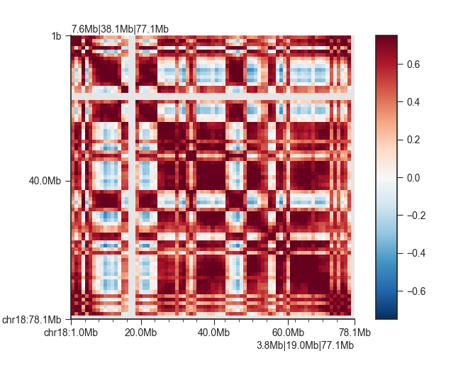
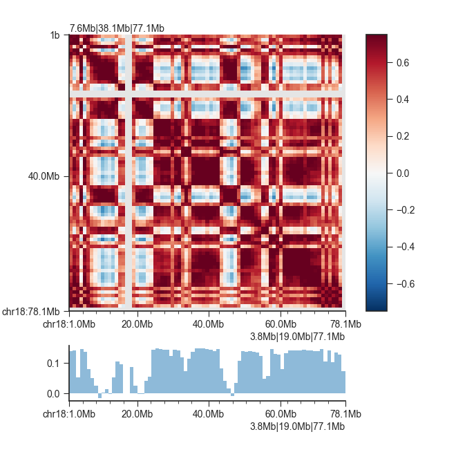
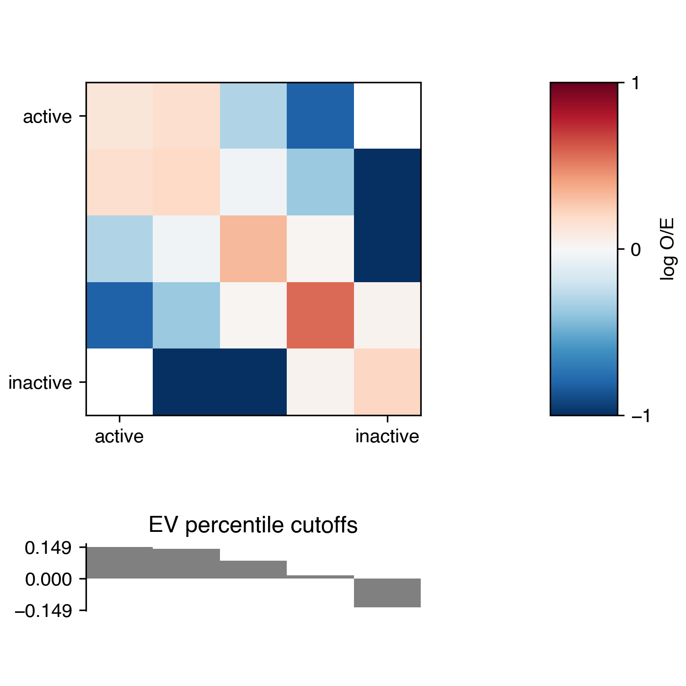
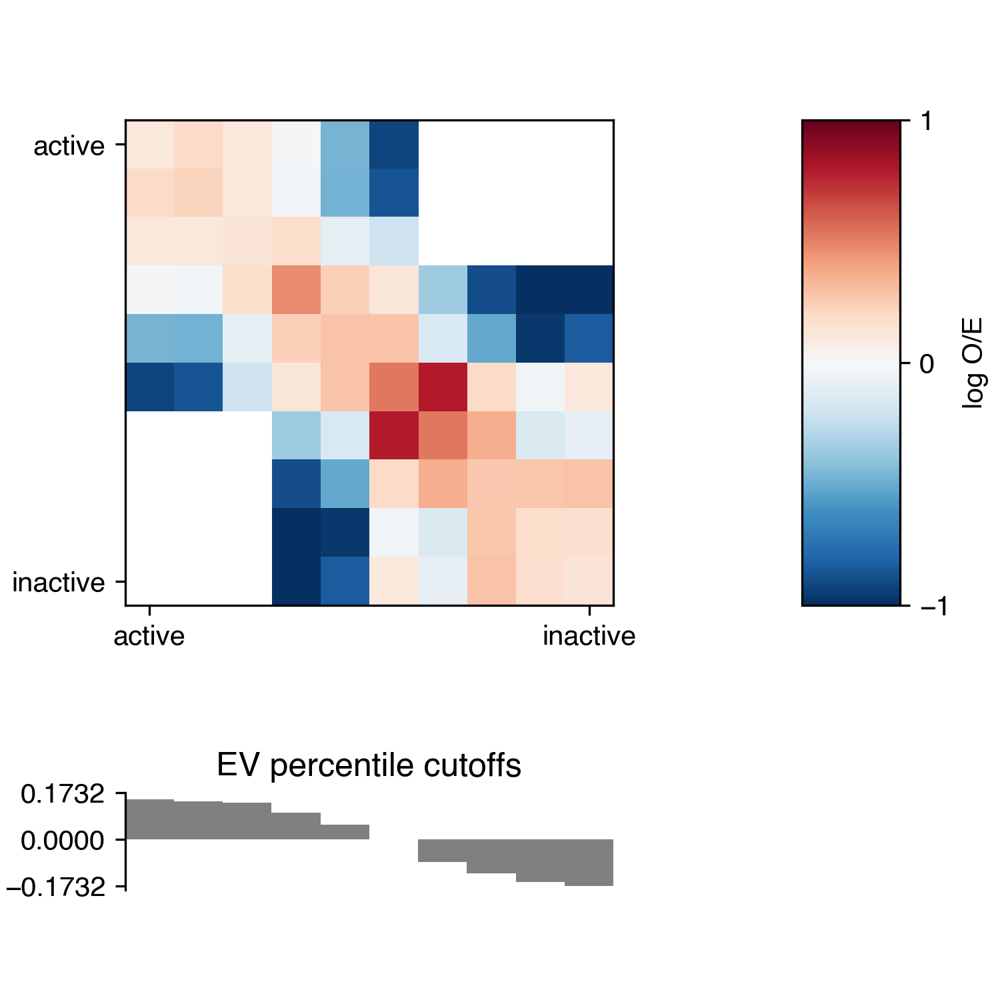

.. _kaic-ab-compartments:

#######################
AB compartment analysis
#######################

Regions in a Hi-C matrix can generally be assigned to either the active or the inactive
compartment, also called 'A' and 'B' compartments, respectively.

.. argparse::
   :module: kaic.commands.kaic_commands
   :func: compartments_parser
   :prog: kaic compartments
   :nodescription:

******************
Correlation matrix
******************

Compartments are derived from a correlation matrix, in which each entry i, j corresponds
to the Pearson correlation between row i and column j of the (Hi-C) matrix.

The ``kaic compartments`` command can produce a correlation matrix (AB compartment) object
from a Kai-C matrix file. Example:

.. code:: bash

    kaic compartments output/hic/binned/kaic_example_1mb.hic \
                      architecture/compartments/kaic_example_1mb.ab

By default, compartment matrices are calculated on a per-chromosome basis, since each
chromosome might be normalised differently. To force the AB calculation on the whole genome,
use the ``-w`` option.

We can quickly plot the correlation matrix using the ``klot`` command:

.. code:: bash

    klot -o architecture/compartments/kaic_example_1mb.ab.png chr18 \
         -p -t hic2d architecture/compartments/kaic_example_1mb.ab \
         -vmin -0.75 -vmax 0.75 -c RdBu_r

**************
AB Eigenvector
**************

The eigenvector of the correlation matrix is used to derive compartment type and strength
for each matrix bin. Generally, regions with positive values are assigned the 'A',
regions with negative values the 'B' compartment. To calculate the eigenvector in addition
to the correlation matrix, simply add the ``-v <file_name>`` option to the previous command:

.. code:: bash

    kaic compartments -v architecture/compartments/kaic_example_1mb.ev.txt \
                      output/hic/binned/kaic_example_1mb.hic \
                      architecture/compartments/kaic_example_1mb.ab

If ``architecture/compartments/kaic_example_1mb.ab`` already exists, it will not be recalculated
but the matrix is loaded from file. You can use the ``-f`` option to overwrite the existing file
in any case.

Alternatively, if you have already calculated the correlation matrix previously, simply run

.. code:: bash

    kaic compartments -v architecture/compartments/kaic_example_1mb.ev.txt \
                      architecture/compartments/kaic_example_1mb.ab

Note that I have not specified an output file for the correlation matrix in this case.

We can plot the eigenvector using ``klot``:

.. code:: bash

    klot -o architecture/compartments/kaic_example_1mb.ab_and_ev.png chr18 \
         -p -t hic2d architecture/compartments/kaic_example_1mb.ab \
         -vmin -0.75 -vmax 0.75 -c RdBu_r \
         -p -t region architecture/compartments/kaic_example_1mb.ev.txt

``kaic compartments`` outputs the first eigenvector by default. In some cases it might be
useful to choose a different eigenvector (sometimes the first eigenvector identifies
chromosomal arms rather than compartments). To change the eiegnvector use the `--i`` option,
e.g. ``-i 2`` for the second instead of the first correlation matrix eigenvector.

The sign of the eigenvector does not necessarily correspond well to the A or B compartment.
Often, the eigenvector is "flipped" (inverted signs on its entries). Mathematically, if x
is an eigenvector, so is -x. You can use external information to "orient" the eigenvector,
so that it most likely corresponds to the active and inactive compartments. Specifically,
you can supply a FASTA file with the genomic sequence to ``kaic compartments`` using the
``-g <fasta_file>`` argument., This is typically a good idea: ``kaic compartments`` then
calculates the average GC content of regions with positive and those with negative eigenvector
entries. As GC content has previously been shown to correlate well with compartmentalisation,
the eigenvector is oriented in such a way that negative entries correspond to 'B' (low GC
content) and positive entries to 'A' (high GC content).

.. code:: bash

    kaic compartments -g hg19_chr18_19.fa -v architecture/compartments/kaic_example_1mb.ev_gc.txt \
                      architecture/compartments/kaic_example_1mb.ab

**********
AB domains
**********

Consecutive matrix bins with the same eigenvector sign are considered part of a "domain".
You can use the ``-d <domain_file>`` option to write the AB domains to a BED file:

.. code:: bash

    kaic compartments -d architecture/compartments/kaic_example_1mb.domains.bed \
                      architecture/compartments/kaic_example_1mb.ab

Again, it is recommended to supply the genome for a better assignment of 'A' and 'B' to
each domain:

.. code:: bash

    kaic compartments -g hg19_chr18_19.fa \
                      -d architecture/compartments/kaic_example_1mb.domains_gc.bed \
                      architecture/compartments/kaic_example_1mb.ab

The output contains the domain type in the "name" field and the average eigenvector entry
values of all bins in the domain in the "score" field.

.. code::

    chr18	1	1000000	B	-0.12249702960252762	.
    chr18	1000001	2000000	B	-0.13098745420575142	.
    chr18	2000001	3000000	B	-0.13427587101856867	.
    chr18	3000001	4000000	B	-0.11395557783544064	.
    chr18	4000001	5000000	B	-0.12023434191942214	.
    chr18	5000001	6000000	B	-0.12307910745342572	.
    chr18	6000001	7000000	B	-0.11700344830751419	.
    chr18	7000001	8000000	B	-0.10866258200258017	.
    chr18	8000001	9000000	B	-0.09937600584493743	.
    chr18	9000001	10000000	A	-0.08777026627212763	.
    ...

**********************
AB enrichment profiles
**********************

The compartmentalisation of a genome can be visualised in an enrichment profile plot.
This will divide bins into percentiles using the associated eigenvector values, and then
the average observed/expected (O/E) values of contacts in each pair of percentile bins
is calculated and plotted.

Use the ``-e <plot_file>`` option to generate this plot. You can also use the
``-m <matrix_file>`` option to output the enrichment matrix values to file for further
analysis.

.. code:: bash

    kaic compartments -e architecture/compartments/kaic_example_1mb.ab_profile.pdf /
                      output/hic/binned/kaic_example_1mb.hic \
                      architecture/compartments/kaic_example_1mb.ab

Note that for the enrichment plot you will also need to provide the Hi-C matrix file for
enrichment calculation. If the AB compartment matrix already exists at the output location,
it will not be overwritten unless you are using the ``-f`` option.

As with the above commands, it is highly recommended to supply a genome file to properly
orient the eigenvector:

.. code:: bash

    kaic compartments -g hg19_chr18_19.fa \
                      -e architecture/compartments/kaic_example_1mb.ab_profile.pdf /
                      output/hic/binned/kaic_example_1mb.hic \
                      architecture/compartments/kaic_example_1mb.ab

This is what the plot looks like for the example:

You can customise the enrichment analysis using additional parameters. By default, the
percentiles for eigenvector binning are chosen at 20, 40, 60, 80, and 100. To choose a
finer binning, for example, you can use ``-p 10 20 30 40 50 60 70 80 90 100``. The "0"
percentile is always added automatically. The eignevector values are not necessarily
centred around 0, which can lead to some unexpected enrichment plots. To force the central
enrichment matrix bin to 0, and perform separate percentile calculations for values < 0 and
>= 0, use the ``-s 0`` option. Note, however, that this will lead to differences in the
number of bins plotted on the left and right side of the matrix.

To format the plot, you can choose a different colormap with ``-c <cmap>``. See
`here <https://matplotlib.org/examples/color/colormaps_reference.html>`_ for colormap
options. You can set the colorbar scale with ``--enrichment-min <n>`` and
``--enrichment-max <n>``, where n is -1 and 1, respectively.