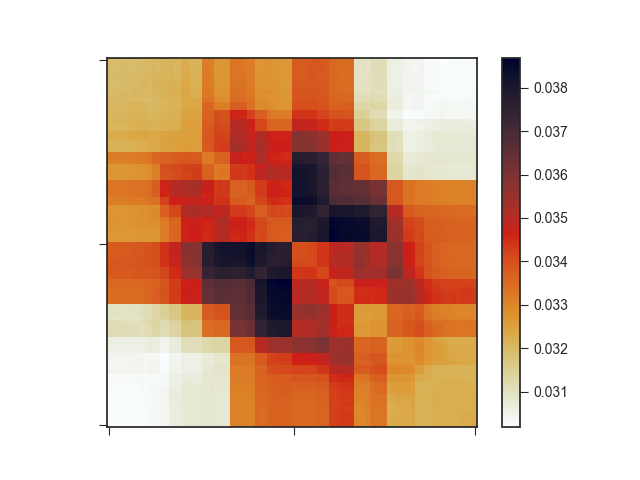
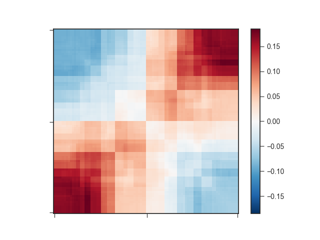
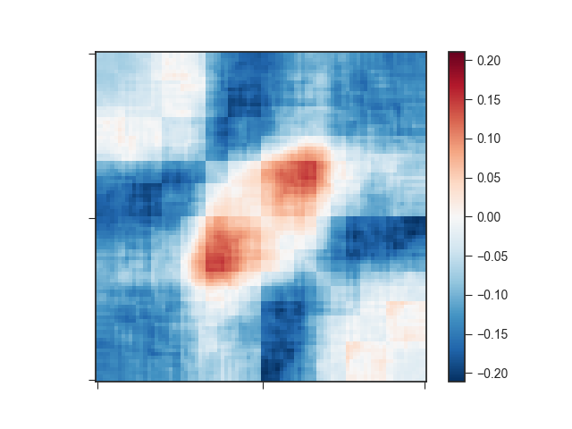
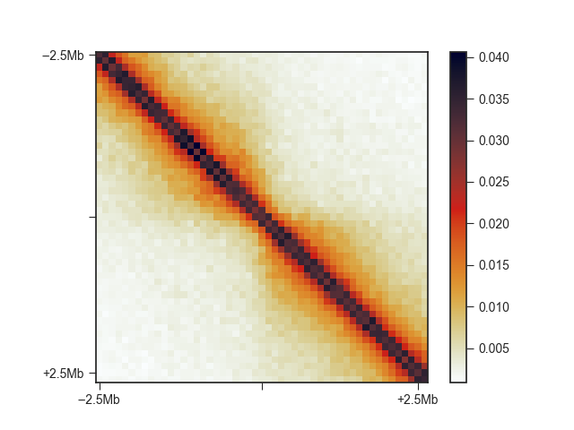
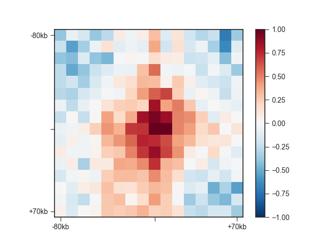

.. _kaic-aggregate:

#######################
Hi-C aggregate analysis
#######################

It can be very informative to view the average Hi-C matrix for a set of regions, rather
than the Hi-C matrix at each individual region. This can help you in identifying common
structural features of these regions or over-/under-representation of contacts in the
vicinity.

Here are examples of TAD and loop aggregate plots from our recent preprint
(`Kruse et al. (2019) <https://www.biorxiv.org/content/10.1101/523712v1>`_):

.. image:: images/aggregate_examples_biorxiv.png

You can easily create your own aggregate plots using ``kaic aggregate``.

.. argparse::
   :module: kaic.commands.kaic_commands
   :func: aggregate_parser
   :prog: kaic aggregate
   :nodescription:
   :nodefault:

You can provide ``kaic aggregate`` with a list of genomic regions in any of the common
region-based formats (BED, GFF, BigWig, ...) or with a list of genomic region pairs in
BEDPE format. For lists of regions, the aggregate matrix will be located at the Hi-C
matrix diagonal. For pairs of regions, matrix subsets can be anywhere in the genome.

************************************
Aggregate over variable size regions
************************************

By default, if you provide ``kaic aggregate`` with a list of regions, it will extract
the square Hi-C sub-matrices along the diagonal for each region and interpolate them
to match the width set by ``--pixels`` (90 by default). It will then calculate the
average value for each pixel, which then form the aggregate matrix.

Let's try this on TADs called using the arrowhead algorithm (`Rao and Huntley et al.,
2014 <http://dx.doi.org/10.1016/j.cell.2014.11.021>`_). ``kaic aggregate`` will ignore
all regions in the file that are not present in the Hi-C matrix. In our example Hic file,
that is everything outside of chromosomes 18 and 19:

.. code::

    kaic aggregate output/hic/binned/kaic_example_100kb.hic \
                   architecture/domains/gm12878_tads.bed \
                   architecture/aggregate/kaic_example_100kb.agg

This command only produces an AggregateMatrix file (``kaic_example_100kb.agg``), which
 is useful for further usage with Kai-C, but not easily readable. To extract the aggregate
matrix in txt format, simply add ``-m`` and to plot it just use ``-p``:

.. code::

    kaic aggregate output/hic/binned/kaic_example_100kb.hic \
                   architecture/domains/gm12878_tads.bed \
                   architecture/aggregate/kaic_example_100kb.agg \
                   -p architecture/aggregate/kaic_example_100kb.agg.png \
                   -m architecture/aggregate/kaic_example_100kb.agg.txt

The resulting plot looks a bit strange:

Important note: if your input regions have variable sizes, as assumed in this section,
the resulting aggregate matrix with default settings is highly misleading, since smaller
regions will have larger average signal in the interpolated matrix due to being closer to
the diagonal. You can easily correct for this effect using O/E matrices instead of the
regular Hi-C matrix. Simply set the ``-e`` flag for this. ``-e`` works very well with
log2-transformed data (``-l``). Let's see how this changes your matrix:

.. code::

    kaic aggregate output/hic/binned/kaic_example_100kb.hic \
                   architecture/domains/gm12878_tads.bed \
                   architecture/aggregate/kaic_example_100kb.agg \
                   -p architecture/aggregate/kaic_example_100kb_oe.agg.png \
                   -m architecture/aggregate/kaic_example_100kb_oe.agg.txt \
                   -e -l

This still does not look like much of a TAD, but we can add a little more context by
expanding the plotting region relative to the region size using ``-r``:

.. code::

    kaic aggregate output/hic/binned/kaic_example_100kb.hic \
                   architecture/domains/gm12878_tads.bed \
                   architecture/aggregate/kaic_example_100kb.agg \
                   -p architecture/aggregate/kaic_example_100kb_oe_large.agg.png \
                   -m architecture/aggregate/kaic_example_100kb_oe_large.agg.txt \
                   -e -l -r 1.0

That plot depicts a region that is 3x the size of the TAD located in its center and
already looks like we would expect: High signal in the center, especially at the TAD
corner, where the corner loops are typically located.

We can further apply an exponential rescaling (``--rescale``) of the data to make this
look more like a Hi-C matrix:

.. code::

    kaic aggregate output/hic/binned/kaic_example_100kb.hic \
                   architecture/domains/gm12878_tads.bed \
                   architecture/aggregate/kaic_example_100kb.agg \
                   -p architecture/aggregate/kaic_example_100kb_oe_large.agg.png \
                   -m architecture/aggregate/kaic_example_100kb_oe_large.agg.txt \
                   -e -r 1.0 --rescale --vmax 0.045

.. image:: images/kaic_example_100kb_oe_large_res.agg.png

Here, we are not log-transforming the data and we are setting the saturation of the
pixel values at 0.045 using ``--vmax``.

**************
Aggregate TADs
**************

For both the log2(O/E) and rescaled versions of the aggregate matrices, there are
preset flags you can use called ``--tads`` and ``--tads-flyamer``, respectively. The
latter is named after the first author of the publication that first used rescaled
aggregate matrices in this fashion
(`Flyamer et al., 2017 <http://www.nature.com/doifinder/10.1038/nature21711>`_). In
the above example, you can simply run

.. code::

    kaic aggregate output/hic/binned/kaic_example_100kb.hic \
                   architecture/domains/gm12878_tads.bed \
                   architecture/aggregate/kaic_example_100kb.agg \
                   -p architecture/aggregate/kaic_example_100kb_oe_large.agg.png \
                   -m architecture/aggregate/kaic_example_100kb_oe_large.agg.txt \
                   --tads

*******************
Fixed-width regions
*******************

Sometimes, you may want to use a fixed window surrounding a set of features in the
aggregate analysis, such as TAD boundaries. ``kaic aggregate`` provides the ``-w``
option to plot the aggregate Hi-C matrix in a window os size w around the center
of each region in the list provided.

.. code::

    kaic aggregate output/hic/binned/kaic_example_100kb.hic \
                   architecture/domains/kaic_example_100kb.insulation_boundaries_score0.7_1mb.bed \
                   architecture/aggregate/kaic_example_100kb_boundaries.agg \
                   -w 5mb -p architecture/aggregate/kaic_example_100kb_boundaries.agg.png \
                   -m architecture/aggregate/kaic_example_100kb_boundaries.agg.txt

You can see the relatively faint "average boundary" in the centre of the plot. When using
O/E and log2-transformed matrices, this becomes much more obvious:

.. code::

    kaic aggregate output/hic/binned/kaic_example_100kb.hic \
                   architecture/domains/kaic_example_100kb.insulation_boundaries_score0.7_1mb.bed \
                   architecture/aggregate/kaic_example_100kb_boundaries_oe.agg \
                   -w 5mb -p architecture/aggregate/kaic_example_100kb_boundaries_oe.agg.png \
                   -m architecture/aggregate/kaic_example_100kb_boundaries_oe.agg.txt \
                   -e -l

.. image:: images/kaic_example_100kb_boundaries_oe.agg.png

You can change the viewpoint to other positions within a region, such as the 5' end,
using the ``-v`` option.

****************************************
Loops and other pairwise genomic regions
****************************************

When you have loop calls or other pairwise genomic regions in BEDPE format, you can use
``kaic aggregate`` to make aggregate loop plots. The preset for this is ``--loops``.

.. code::

    kaic aggregate architecture/loops/rao2014.chr11_77400000_78600000.hic \
                   architecture/loops/rao2014.chr11_77400000_78600000.loops_no_singlets.bedpe \
                   architecture/loops/rao2014.chr11_77400000_78600000.loops_no_singlets.agg \
                   -p architecture/aggregate/rao2014.chr11_77400000_78600000.loops_no_singlets.agg.png \
                   --loops

Control the size of the plot using the ``--pixels`` argument.