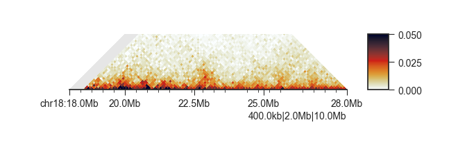
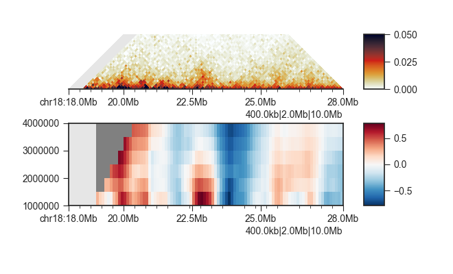
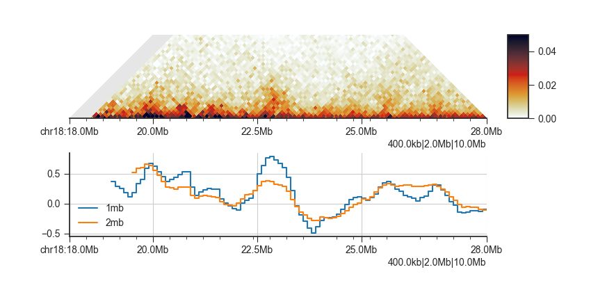
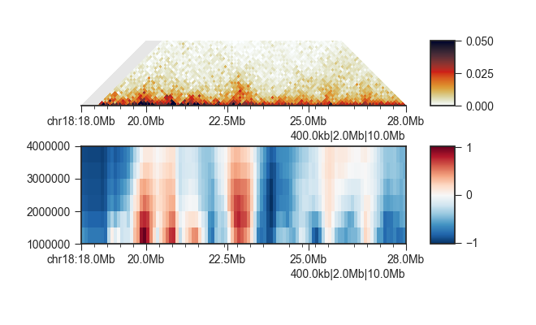
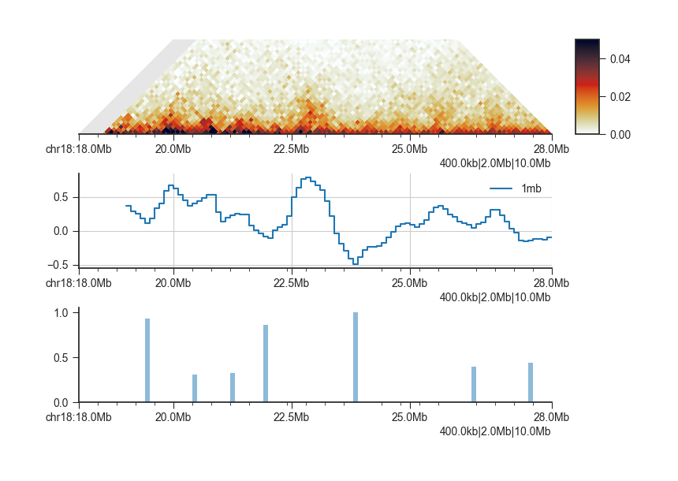
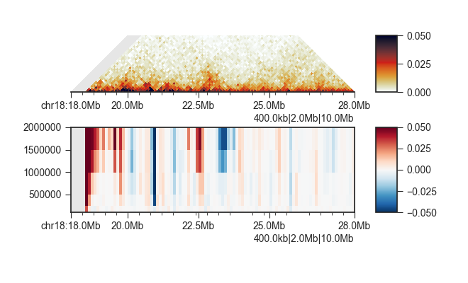

.. _kaic-domains:

####################
Hi-C domain analysis
####################

Like compartments, topologically associating domains, or TADs, for a fundamental level of
genome organisation.

.. code::

    klot -o architecture/domains/kaic_example_50kb_tads.png chr18:18mb-28mb \
         -p -t hic output/hic/binned/kaic_example_100kb.hic -m 4000000 \
         -vmin 0 -vmax 0.05

Kai-C provides multiple "scores" that are designed to find the boundaries between domains.

****************
Insulation Score
****************

The insulation score (`Crane et al. 2015 <http://www.nature.com/doifinder/10.1038/nature14450>`_)
adds up contacts in a sliding window alogn the Hi-C matrix diagonal.

.. image:: images/kaic_example_100kb_tads_insulation_score_example.png

Regions with low score are "insulating", i.e. regions between domains. Regions with high scores
are most likely found inside domains.

Use ``kaic insulation`` to calculate the insulation score from the command line:

.. argparse::
   :module: kaic.commands.kaic_commands
   :func: insulation_parser
   :prog: kaic insulation
   :nodescription:

=======
Example
=======

``kaic insulation`` is typically used to calculate insulation scores with multiple window
sizes at the same time, as a single window size might be prone to local matrix differences:

.. code::

    kaic insulation output/hic/binned/kaic_example_100kb.hic \
                    architecture/domains/kaic_example_100kb.insulation \
                    -w 1000000 1500000 2000000 2500000 3000000 3500000 4000000

Window sizes are chosen using the ``-w`` parameter.

We can easily plot all insulation scores at the same time using ``klot``:

.. code::

    klot -o architecture/domains/kaic_example_50kb_tads_insulation.png chr18:18mb-28mb \
         -p -t hic output/hic/binned/kaic_example_100kb.hic -m 4000000 -vmin 0 -vmax 0.05 \
         -p -t array architecture/domains/kaic_example_100kb.insulation

==============
Output formats
==============

The default output format has maximum compatibility within Kai-C, but other tools like
genome browsers won't be able to read it. Export of insulation scores to a different
format is simple. Just choose ``-output-format bed`` to export to BED file,
``-output-format gff`` to export to GFF format, or ``-output-format bigwig`` to export
to an indexed BigWig file. The latter is a binary file, and hence not readable as
text format, but is the fastest for accessing subsets of scores.

When using an output format other than the default, the second positional argument
(output) becomes an output file prefix. It is appended by the window size (in
abbreviated form, i.e. 1000000 becomes "1mb") and gets the file ending of the chosen
format. Example:

.. code::

    kaic insulation output/hic/binned/kaic_example_100kb.hic \
                    architecture/domains/kaic_example_100kb.insulation \
                    -w 1000000 1500000 2000000 2500000 3000000 3500000 4000000
                    -o bed

This produces the output files:

.. code::

    architecture/domains/kaic_example_100kb.insulation_1.5mb.bed
    architecture/domains/kaic_example_100kb.insulation_1mb.bed
    architecture/domains/kaic_example_100kb.insulation_2.5mb.bed
    architecture/domains/kaic_example_100kb.insulation_2mb.bed
    architecture/domains/kaic_example_100kb.insulation_3.5mb.bed
    architecture/domains/kaic_example_100kb.insulation_3mb.bed
    architecture/domains/kaic_example_100kb.insulation_4mb.bed

Of course, you can also simply convert existing insulation scores to another format
without having to recalculate everything. Simply run:

.. code::

    kaic insulation architecture/domains/kaic_example_100kb.insulation \
                    -o bed

and the insulation scores for all window sizes in the object will be converted to BED
files using the input file name as prefix. If you only want to convert specific window
sizes, use the ``-w`` parameter. To find out which window sizes are available in a
previously calculated scores object, simply run ``kaic insulation`` without any
parameters:

.. code::

    kaic insulation architecture/domains/kaic_example_100kb.insulation

This prints:

.. code::

    Window sizes available in object:
    1mb 1.5mb 2mb 2.5mb 3mb 3.5mb 4mb

You can plot scores from one or more window sizes using the ``line`` plot in ``klot``:

.. code::

    klot --width 6 -o architecture/domains/kaic_example_50kb_tads_insulation_1mb.png \
                   chr18:18mb-28mb \
                   -p -t hic output/hic/binned/kaic_example_100kb.hic -m 4000000 \
                   -vmin 0 -vmax 0.05 \
                   -p -t line architecture/domains/kaic_example_100kb.insulation_1mb.bed \
                   architecture/domains/kaic_example_100kb.insulation_2mb.bed \
                   -l "1mb" "2mb"

=============
Normalisation
=============

By default, ``kaic insulation`` will normalise the insulation scores to the chromosomal
average and the log-transform them. You can get raw, untransformed scores using ``-N`` and
``--L``, respectively. If you want to normalise the scores, but to a smaller region on the
chromosome (to take into account local variability in insulation), you can choose the
normalisation window size with ``--normalisation-window``. The window is specified in bins.

Normally, ``kaic insulation`` will use the arythmetic mean of the chromosomal scores to
normalise. This has the effect that scores upon log2-transformation are not perfectly
centred around 0. To remedy this, you can use the geometric mean instead, with the ``-g``
option.

When you are working with matrices that are already log2-transformed, you may want to use
the ``-s`` option to normalise the scores by subtracting, instead of dividing the chromosomal
average.

If you have a lot of outliers and sharp score changes, you may use a trimmed mean
to calculate average scores with ``--trim-mean <f>``, which will ignore the top and bottom
fraction *f* of scores for calculating the average.

=====================
Impute missing values
=====================

In the above examples, you will notice the region on the left that is unmappable in the Hi-C
matrix. In the insulation score calculation, if the insulation window is covered by more than
50% of unmappable regions, the score will be NaN. ``kaic insulation`` offers the option to
impute the unmappable values from the expected values of the chromosome using ``--impute``.

.. code::

    kaic insulation output/hic/binned/kaic_example_100kb.hic \
                    architecture/domains/kaic_example_100kb.insulation_imputed \
                    -w 1000000 1500000 2000000 2500000 3000000 3500000 4000000 \
                    --impute

This will result in score without NaN (at least in the center of chromosomes), but can also
be misleading if the region of interest happens to lie in an unmappable region. Therefore use
this capability with caution!

.. code::

    klot -o architecture/domains/kaic_example_50kb_tads_insulation.png chr18:18mb-28mb \
         -p -t hic output/hic/binned/kaic_example_100kb.hic -m 4000000 -vmin 0 -vmax 0.05 \
         -p -t array architecture/domains/kaic_example_100kb.insulation \
         --impute

**************************************
Insulating boundaries (TAD boundaries)
**************************************

Regions in the genome where the insulation score reaches a local minimum represent the region
between two self-interacting domains, or TADs. You can use ``kaic boundaries`` to identify these
regions:

.. argparse::
   :module: kaic.commands.kaic_commands
   :func: boundaries_parser
   :prog: kaic boundaries
   :nodescription:

When we run ``kaic boundaries`` on the above example using 1mb and 2mb as the window sizes:

.. code::

    kaic boundaries architecture/domains/kaic_example_100kb.insulation \
                    architecture/domains/kaic_example_100kb.insulation_boundaries \
                    -w 1mb 2mb

We get two output files with all insulation score minima and associated scores (the depth of
the minimum compared to the two neighboring maxima):

.. code::

    kaic_example_100kb.insulation_boundaries_1mb.bed
    kaic_example_100kb.insulation_boundaries_2mb.bed

Let's plot the boundaries from the 1mb scores:

.. code::

    klot --width 6 -o architecture/domains/kaic_example_50kb_tads_insulation_1mb_boundaries.png \
         chr18:18mb-28mb \
         -p -t hic output/hic/binned/kaic_example_100kb.hic -m 4000000 -vmin 0 -vmax 0.05 \
         -p -t line architecture/domains/kaic_example_100kb.insulation_1mb.bed -l "1mb" \
         -p -t region architecture/domains/kaic_example_100kb.insulation_boundaries_1mb.bed

As you can see, lower minima get higher scores. By default, ``kaic boundaries`` outputs all
minima, but you may set a threshold using ``--min-score <s>`` to report only boundaries with
scores greater than *s*.

.. code::

    kaic boundaries architecture/domains/kaic_example_100kb.insulation \
                    architecture/domains/kaic_example_100kb.insulation_boundaries_score0.7 \
                    -w 1mb 2mb --min-score 0.7

By default, ``kaic boundaries`` will return minima as matrix bins. However, since the boundary
calls rely on a smoothed insulation score track, it can attempt to identify the boundary location
with sub-bin resolution. Use ``-x`` to try this, but be aware that this is not precise.

********************
Directionality Index
********************

The directionality index (`Dixon et al. 2012 <http://www.nature.com/doifinder/10.1038/nature11082>`_)
measures the bias in contact frequency up- and downstream of an Hi-C region. When inside TADs,
this measure tends towards zero, as interactions in either direction are equally frequent. However,
when approaching a TAD boundary this measure changes drastically, as one direction will remain
inside the TAD, where there is a high contact intensity, whereas the other direction will lie in
a low intensity region outside the TAD.

Use ``kaic directionality`` to calculate the directionality index from the command line:

.. argparse::
   :module: kaic.commands.kaic_commands
   :func: directionality_parser
   :prog: kaic directionality
   :nodescription:

=======
Example
=======

``kaic directionality`` is very similar in syntax to ``kaic insulation``.
It is typically used to calculate directionality indexes with multiple window
sizes at the same time, as a single window size might be prone to local matrix differences:

.. code::

    kaic directionality output/hic/binned/kaic_example_100kb.hic \
                        architecture/domains/kaic_example_100kb.directionality \
                        -w 1000000 1500000 2000000 2500000 3000000 3500000 4000000

Window sizes are chosen using the ``-w`` parameter.

We can easily plot all directionality indexes at the same time using ``klot``:

.. code::

    klot -o architecture/domains/kaic_example_50kb_tads_directionality.png chr18:18mb-28mb \
         -p -t hic output/hic/binned/kaic_example_100kb.hic -m 4000000 -vmin 0 -vmax 0.05 \
         -p -t array architecture/domains/kaic_example_100kb.directionality

To export the directionality index to other genomic formats using ``kaic directionality``
follow the instructions as for ``kaic insulation``.

*********************
A note on TAD calling
*********************

There are a lot of tools available for calling TADs in Hi-C matrices, including one that
we have written called `TADtool <https://github.com/vaquerizaslab/tadtool>`_. However,
and this is a point we are also making with TADtool specifically, TAD calling algorithms
often depend critically on their input parameters, and different TAD callers can lead to
very different results. We are therefore currently not bundling a TAD calling tool with
Kai-C, and refer the user to one of the many available tools for TAD calling that offer
a wide range of features.